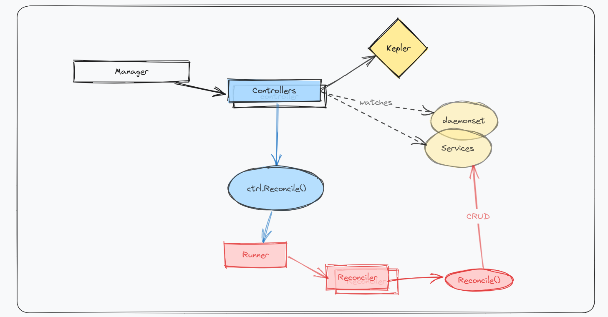
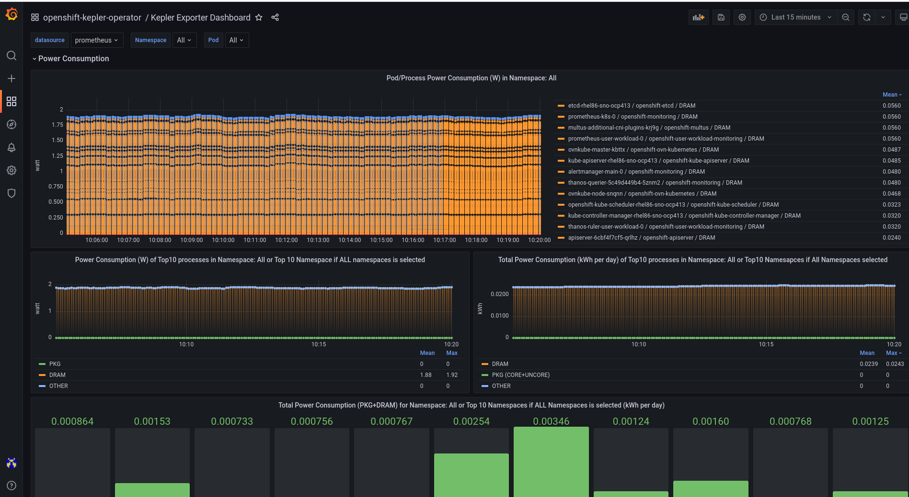

# Kepler Operator Stack

## Architecture / Topology



This example deploys a kepler operator stack in Openshift's `openshift-operators` namespace 
and uses eBPF to probe energy-related system stats and exports them as Prometheus metrics.

## Steps

Assuming that Kepler operator is installed, follow the steps below to create a Kepler instance 
which is the Schema for the keplers API that uses the in-cluster Prometheus to 
scrape energy-related metrics.

### Create a Kepler instance

```yaml
kind: Kepler
apiVersion: kepler.system.sustainable.computing.io/v1alpha1
metadata:
  labels:
    app.kubernetes.io/instance: kepler
    app.kubernetes.io/name: kepler
    app.kubernetes.io/part-of: kepler-operator
  name: kepler
spec:
  exporter:
    port: 9103
```

### Deploy Grafana

**NOTE:** `deploy-grafana.sh` script execution shall take few seconds to complete.

```bash
$ git clone https://github.com/sustainable-computing-io/kepler-operator.git
Cloning into 'kepler-operator'...
remote: Enumerating objects: 7238, done.
remote: Counting objects: 100% (764/764), done.
remote: Compressing objects: 100% (364/364), done.
remote: Total 7238 (delta 412), reused 608 (delta 345), pack-reused 6474
Receiving objects: 100% (7238/7238), 28.85 MiB | 13.80 MiB/s, done.
Resolving deltas: 100% (3550/3550), done.

$ cd kepler-operator

$ ./hack/dashboard/openshift/deploy-grafana.sh
```

## Validation

Verify if the Grafana dashboard is accessible by accessing the Grafana UI using credentials 
`kepler:kepler`

