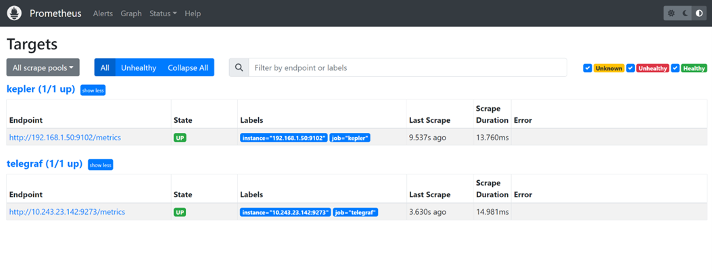
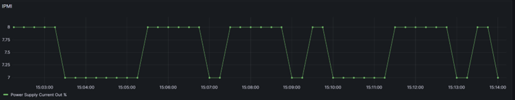

Introduction
==========================

Kepler (Kubernetes-based Efficient Power Level Exporter) is a Prometheus
exporter. It uses eBPF to probe CPU performance counters and Linux
kernel tracepoints [\[1\]](#references) whereas Telegraf is an agent
for collecting, processing, aggregating, and writing metrics.
[\[2\]](#references)This document covers the steps for integrating
Telegraf with Kepler.

Benefits of Integrating Telegraf with Kepler
===========================================================

Integrating Telegraf with Kepler helps users to gather additional platform level metrics on top of Kepler metrics. Kepler provide useful container and Node metrics. On the other hand, through Telegraf, metrics like Power Supply Current output (%) can be gathered using IPMI Sensor plugin. Also, it can help to gather DPDK related metrics which is currently not possible through Kepler. By correlating power and CPU usage metrics from Kepler and DPDK metrics from Telegraf, user will gain a better understanding about the power usage of their packet processing application and can use these insights as inputs to identify opportunities for power optimization. Hence, Kepler and Telegraf metrics together can serve use cases that help end users to understand and optimize power usage by their various networking applications.

Setup
====================


Setup Details
============================

The Control plane server details are as follows:


| Components  | Details |
| ------------- |:-------------:|
| Model      | Intel(R) Xeon(R) Gold 6230N CPU @ 2.30GHz     |
| Sockets      | 2     |
| Cores per sockets      | 20     |
| Total Cores      | 80     |
| Software      | Ubuntu 22.04.1 LTS     |


Download and Install kepler
============================

There are various ways Kepler can be downloaded and installed. For more
details on each steps please refer to the [Kepler
documents.](https://sustainable-computing.io/installation/kepler/)

```
root@: git clone https://github.com/sustainable-computing-io/kepler.git
root@: cd kepler/
root@: make build-manifest OPTS="BM_DEPLOY PROMETHEUS_DEPLOY"
root@: cd _output/generated-manifest/
root@: vi deployment.yaml
root@: kubectl apply -f _output/generated-manifest/deployment.yaml
```
Installation of Kepler can be confirmed through following commands:

```
root@: docker ps -a | grep 'kepler'

530a71f0067f        quay.io/sustainable_computing_io/kepler           "/bin/sh –
c '/usr/bi…"   33 seconds ago      Up 31 seconds                                   
k8s_kepler-exporter_kepler-exporter-bzj9b_kepler_827ee818-9f5a-460c-a368-
fc90fde5d378_0
decae0dc60e2        k8s.gcr.io/pause:3.3                              "/pause"                
38 seconds ago      Up 35 seconds                                   
k8s_POD_kepler-exporter-bzj9b_kepler_827ee818-9f5a-460c-a368-fc90fde5d378_0
 
root@:~# kubectl get pod -n kepler
NAME                    READY   STATUS    RESTARTS   AGE
kepler-exporter-8h8x7   1/1     Running   0          63s
kepler-exporter-bzj9b   1/1     Running   0          63s
root@:~# kubectl port-forward kepler-exporter-jdklk 9102:9102 -n kepler --address='0.0.0.0'

```

Download and start the Telegraf
==============================================

Telegraf can be installed on the system in various ways. Here it has
been done by downloading and building it from source.

Telegraf requires Go version \>=1.22 which can be installed : [Install
Go](https://golang.org/doc/install) and the Makefile requires GNU make.

Telegraf shares the same [minimum
requirements](https://go.dev/wiki/MinimumRequirements) as Go:

-   Linux kernel version 2.6.32 or later

-   Windows 10 or later

-   FreeBSD 12 or later

-   macOS 10.15 Catalina or later

Clone the Telegraf repository:
```
root@:~# git clone https://github.com/influxdata/telegraf.git
```
Run make build from the source directory
```
root@:~# cd telegraf
root@:~# make build

```
Generate a Telegraf config file
```
root@:~# telegraf config > telegraf.conf
```
Edit the generated config file to enable required plugins. For this
integration activity following plugins should be enabled:

**Input Plugins:** [Intel PowerStat
plugin](https://github.com/influxdata/telegraf/tree/master/plugins/inputs/intel_powerstat),
[Intel PMU
plugin](https://github.com/influxdata/telegraf/tree/master/plugins/inputs/intel_pmu),
and [IPMI
sensor](https://github.com/influxdata/telegraf/tree/master/plugins/inputs/ipmi_sensor)
input

**Output Plugin:** [Prometheus output
plugin](https://github.com/influxdata/telegraf/tree/master/plugins/outputs/prometheus_client)
must be enabled in Telegraf config in order to store the metrics in
Prometheus database .

Below is the sample config that have been used to enable all the
above-mentioned plugins. Although, user can enable any other desired
plugin by commenting out the respective section.

```
root@:~# vi telegraf.conf

# Global tags can be specified here in key="value" format.
[global_tags]
  # dc = "us-east-1" # will tag all metrics with dc=us-east-1
  # rack = "1a"
  ## Environment variables can be used as tags, and throughout the config file
  # user = "$USER"

# Configuration for telegraf agent
[agent]
  ## Default data collection interval for all inputs
  interval = "10s"
  ## Rounds collection interval to 'interval'
  ## ie, if interval="10s" then always collect on :00, :10, :20, etc.
  round_interval = true

  ## Telegraf will send metrics to outputs in batches of at most
  ## metric_batch_size metrics.
  ## This controls the size of writes that Telegraf sends to output plugins.
  metric_batch_size = 1000

  ## Maximum number of unwritten metrics per output.  Increasing this value
  ## allows for longer periods of output downtime without dropping metrics at the
  ## cost of higher maximum memory usage.
  metric_buffer_limit = 10000

  ## Collection jitter is used to jitter the collection by a random amount.
  ## Each plugin will sleep for a random time within jitter before collecting.
  ## This can be used to avoid many plugins querying things like sysfs at the
  ## same time, which can have a measurable effect on the system.
  collection_jitter = "0s"

  ## Default flushing interval for all outputs. Maximum flush_interval will be
  ## flush_interval + flush_jitter
  flush_interval = "10s"
  ## Jitter the flush interval by a random amount. This is primarily to avoid
  ## large write spikes for users running a large number of telegraf instances.
  ## ie, a jitter of 5s and interval 10s means flushes will happen every 10-15s
  flush_jitter = "0s"

  ## By default or when set to "0s", precision will be set to the same
  ## timestamp order as the collection interval, with the maximum being 1s.
  ##   ie, when interval = "10s", precision will be "1s"
  ##       when interval = "250ms", precision will be "1ms"
  ## Precision will NOT be used for service inputs. It is up to each individual
  ## service input to set the timestamp at the appropriate precision.
  ## Valid time units are "ns", "us" (or "µs"), "ms", "s".
  precision = ""

  ## Log at debug level.
  # debug = false
  ## Log only error level messages.
  # quiet = false

  ## Log target controls the destination for logs and can be one of "file",
  ## "stderr" or, on Windows, "eventlog".  When set to "file", the output file
  ## is determined by the "logfile" setting.
  # logtarget = "file"

  ## Name of the file to be logged to when using the "file" logtarget.  If set to
  ## the empty string then logs are written to stderr.
  # logfile = ""

  ## The logfile will be rotated after the time interval specified.  When set
  ## to 0 no time based rotation is performed.  Logs are rotated only when
  ## written to, if there is no log activity rotation may be delayed.
  # logfile_rotation_interval = "0d"

  ## The logfile will be rotated when it becomes larger than the specified
  ## size.  When set to 0 no size based rotation is performed.
  # logfile_rotation_max_size = "0MB"

  ## Maximum number of rotated archives to keep, any older logs are deleted.
  ## If set to -1, no archives are removed.
  # logfile_rotation_max_archives = 5

  ## Pick a timezone to use when logging or type 'local' for local time.
  ## Example: America/Chicago
  # log_with_timezone = ""

  ## Override default hostname, if empty use os.Hostname()
  hostname = ""
  ## If set to true, do no set the "host" tag in the telegraf agent.
  omit_hostname = false

###############################################################################
#                            OUTPUT PLUGINS                                   #
###############################################################################

# # Configuration for the Prometheus client to spawn
[[outputs.prometheus_client]]
  ## Address to listen on
  listen = ":9273"

  ## Metric version controls the mapping from Telegraf metrics into
  ## Prometheus format.  When using the prometheus input, use the same value in
  ## both plugins to ensure metrics are round-tripped without modification.
  ##
  ##   example: metric_version = 1;
  ##            metric_version = 2; recommended version
  # metric_version = 1


###############################################################################
#                            INPUT PLUGINS                                    #
###############################################################################

# # Intel PowerStat plugin enables monitoring of platform metrics (power, TDP) and Core metrics like temperature, power and utilization.
[[inputs.intel_powerstat]]
  ## All global metrics are always collected by Intel PowerStat plugin.
  ## User can choose which per-CPU metrics are monitored by the plugin in cpu_metrics array.
  ## Empty array means no per-CPU specific metrics will be collected by the plugin - in this case only platform level
  ## telemetry will be exposed by Intel PowerStat plugin.
  #the package_metrics setting:
  package_metrics = ["current_power_consumption", "current_dram_power_consumption", "thermal_design_power", "max_turbo_frequency", "uncore_frequency", "cpu_base_frequency"]
  ## Supported options:
  ## "cpu_frequency", "cpu_busy_frequency", "cpu_temperature", "cpu_c1_state_residency", "cpu_c6_state_residency", "cpu_busy_cycles"
  cpu_metrics = ["cpu_frequency", "cpu_busy_frequency", "cpu_temperature", "cpu_c1_state_residency", "cpu_c6_state_residency", "cpu_busy_cycles"]

# Intel Performance Monitoring Unit plugin exposes Intel PMU metrics available through Linux Perf subsystem
# This plugin ONLY supports Linux on amd64
[[inputs.intel_pmu]]
  ## List of filesystem locations of JSON files that contain PMU event definitions.
  event_definitions = ["/root/.cache/pmu-events/GenuineIntel-6-55-7-core.json", "/root/.cache/pmu-events/GenuineIntel-6-55-7-uncore.json"]

  ## List of core events measurement entities. There can be more than one core_events sections.
  [[inputs.intel_pmu.core_events]]
    ## List of events to be counted. Event names shall match names from event_definitions files.
    ## Single entry can contain name of the event (case insensitive) augmented with config options and perf modifiers.
    ## If absent, all core events from provided event_definitions are counted skipping unresolvable ones.
    events = ["INST_RETIRED.ANY", "CPU_CLK_UNHALTED.THREAD_ANY:config1=0x4043200000000k"]

    ## Limits the counting of events to core numbers specified.
    ## If absent, events are counted on all cores.
    ## Single "0", multiple "0,1,2" and range "0-2" notation is supported for each array element.
    ##   example: cores = ["0,2", "4", "12-16"]
    cores = ["0"]

    ## Indicator that plugin shall attempt to run core_events.events as a single perf group.
    ## If absent or set to false, each event is counted individually. Defaults to false.
    ## This limits the number of events that can be measured to a maximum of available hardware counters per core.
    ## Could vary depending on type of event, use of fixed counters.
    # perf_group = false

    ## Optionally set a custom tag value that will be added to every measurement within this events group.
    ## Can be applied to any group of events, unrelated to perf_group setting.
    # events_tag = ""

  ## List of uncore event measurement entities. There can be more than one uncore_events sections.
  [[inputs.intel_pmu.uncore_events]]
    ## List of events to be counted. Event names shall match names from event_definitions files.
    ## Single entry can contain name of the event (case insensitive) augmented with config options and perf modifiers.
    ## If absent, all uncore events from provided event_definitions are counted skipping unresolvable ones.
    events = ["UNC_CHA_CLOCKTICKS", "UNC_CHA_TOR_OCCUPANCY.IA_MISS"]

    ## Limits the counting of events to specified sockets.
    ## If absent, events are counted on all sockets.
    ## Single "0", multiple "0,1" and range "0-1" notation is supported for each array element.
    ##   example: sockets = ["0-2"]
    sockets = ["0"]

    ## Indicator that plugin shall provide an aggregated value for multiple units of same type distributed in an uncore.
    ## If absent or set to false, events for each unit are exposed as separate metric. Defaults to false.
    # aggregate_uncore_units = false

    ## Optionally set a custom tag value that will be added to every measurement within this events group.
    # events_tag = ""
# Read metrics from the bare metal servers via IPMI
[[inputs.ipmi_sensor]]
  ## optionally specify the path to the ipmitool executable
  # path = "/usr/bin/ipmitool"
  ##
  ## Setting 'use_sudo' to true will make use of sudo to run ipmitool.
  ## Sudo must be configured to allow the telegraf user to run ipmitool
  ## without a password.
  use_sudo = true
  ##
  ## optionally force session privilege level. Can be CALLBACK, USER, OPERATOR, ADMINISTRATOR
  # privilege = "ADMINISTRATOR"
  ##
  ## optionally specify one or more servers via a url matching
  ##  [username[:password]@][protocol[(address)]]
  ##  e.g.
  ##    root:passwd@lan(127.0.0.1)
  ##
  ## if no servers are specified, local machine sensor stats will be queried
  ##
  # servers = ["USERID:PASSW0RD@lan(192.168.1.1)"]

  ## Recommended: use metric 'interval' that is a multiple of 'timeout' to avoid
  ## gaps or overlap in pulled data
  interval = "30s"

  ## Timeout for the ipmitool command to complete. Default is 20 seconds.
  timeout = "20s"

  ## Schema Version: (Optional, defaults to version 1)
  metric_version = 2

  ## Optionally provide the hex key for the IMPI connection.
  # hex_key = ""

  ## If ipmitool should use a cache
  ## for me ipmitool runs about 2 to 10 times faster with cache enabled on HP G10 servers (when using ubuntu20.04)
  ## the cache file may not work well for you if some sensors come up late
  # use_cache = false

  ## Path to the ipmitools cache file (defaults to OS temp dir)
  ## The provided path must exist and must be writable
  # cache_path = ""

```
Run Telegraf with the plugins defined in config file:
```
root@:~#./telegraf --config telegraf.conf
```

Download and start the Prometheus container
==========================================================

Prometheus can be installed on a system in various ways. Here it is
downloaded and installed as a container.

Create a Prometheus configuration file that is scrapping from both
Kepler and Telegraf instance:

Sample Prometheus configuration file is as follows:
```
# my global config
global:
scrape_interval:     15s # Set the scrape interval to every 15 seconds. Default is every 1 minute.
evaluation_interval: 15s # Evaluate rules every 15 seconds. The default is every 1 minute.
# scrape_timeout is set to the global default (10s).

# A scrape configuration containing exactly one endpoint to scrape:
# Here it's Prometheus itself.
scrape_configs:
# The job name is added as a label `job=<job_name>` to any timeseries scraped from this config.
	- job_name: 'kepler'
	  static_configs:
		- targets: ['xx.xx.xx:9102'] 
	- job_name: 'telegraf'
	  static_configs:
		- targets: ['xx.xx.xx:9273']

```
Run the Prometheus container with the created Prometheus configuration file:
```
root@:~# docker run -d -p 9090:9090 -v $PWD/prometheus.yaml:/etc/prometheus/prometheus.yml prom/prometheus
```
On the Prometheus GUI at localhost:9090, it can be confirmed that Prometheus is scrapping from Kepler and Telegraf.



Download and start Grafana container
==================================================

Like, Prometheus, Grafana can be installed on the system in various
ways. Here, we are installing Grafana's container image.
```
root@:~# docker run -d --network host --name grafana grafana/grafana
```
Once Grafana container is running access the Grafana GUI at localhost:3000. Login with default credentials. After login, The Prometheus database needs to be added as a data source into Grafana GUI. Click on “DATA SOURCES” -> “Add your first data source”
And select Prometheus - > Click “Save and Test”

Dashboard
=======================

Once Prometheus has been added as a data source, create a dashboard by
exporting
[Kepler-Exporter.json](https://github.com/sustainable-computing-io/kepler/blob/main/grafana-dashboards/Kepler-Exporter.json),
a default Grafana dashboard for Kepler.

This default Kepler dashboard can be edited in order to display Telegraf
metric along with Kepler metrics.

For example in below shown example, right hand shows Power related
metrics collected by Telegraf whereas left hand shows Power related
metrics by Kepler per namespace:


**On Kepler side:**

**PKG-\>** Represents kepler\_container\_package\_joules\_total metrics
which measures the cumulative energy consumed by the CPU socket,
including all cores and uncore components (e.g. last-level cache,
integrated GPU and memory controller).

**DRAM-\>** Represents kepler\_container\_dram\_joules\_total metric which
describes the total energy spent in DRAM by a container.

**Other-\>** Represents kepler\_container\_other\_joules\_total metric
measures the cumulative energy consumption on other host components
besides the CPU and DRAM. Generally, this metric is the host energy
consumption (from acpi) less the RAPL Package and DRAM.

**On Telegraf side:**


**Total PKG current Power->** Represents
powerstat\_package\_current\_power\_consumptions metrics which showcase
Current power consumption of processor package. On Grafana it is the sum
of the metrics on both the sockets i.e.
powerstat\_package\_current\_power\_consumptions of socket 0 +
powerstat\_package\_current\_power\_consumptions of socket 1.

**Total DRAM power ->** Represents
powerstat\_package\_current\_dram\_power\_consumptions metrics which
describes the total energy spent in DRAM of both the sockets.

**Total Thermal design Power ->** Represents
powerstat\_package\_current\_thermal\_power\_consumptions metrics which
describes maximum Thermal Design Power (TDP) available for processor
package. On Grafana it is the sum of the metrics on both the sockets
i.e. powerstat\_package\_current\_thermal\
\_power\_consumptions of socket 0 +
powerstat\_package\_current\_thermal\_power\_consumptions of socket 1.

**Total DRAM Power metrics number on Kepler side and Telegraf side
aligns with each other(approximately).**

Telegraf- IPMI metric
---------------------

On Kepler dashboard, we are also pulling IPMI metrics which show Power
Supply Current out %.




References:
-----------

\[1\] <https://sustainable-computing.io/>

\[2\] <https://github.com/influxdata/telegraf>
