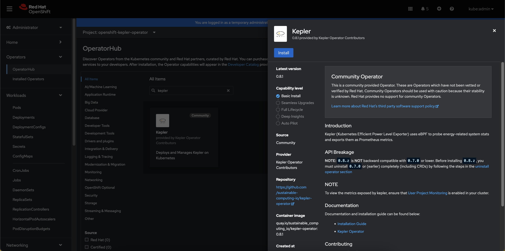
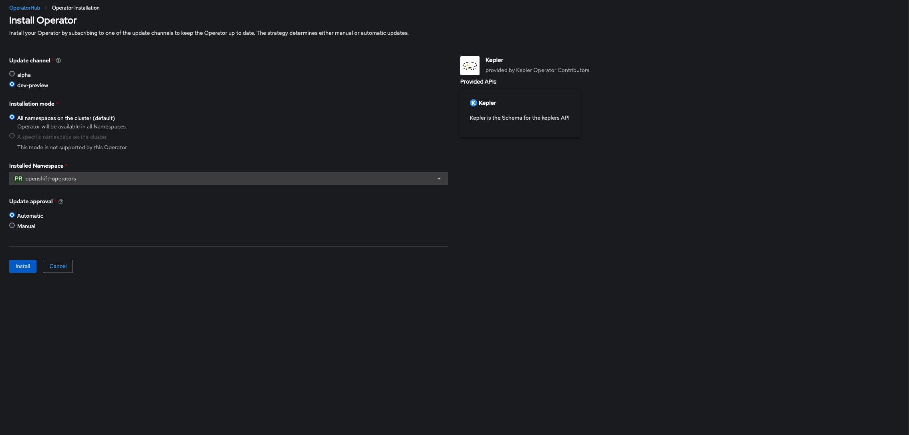
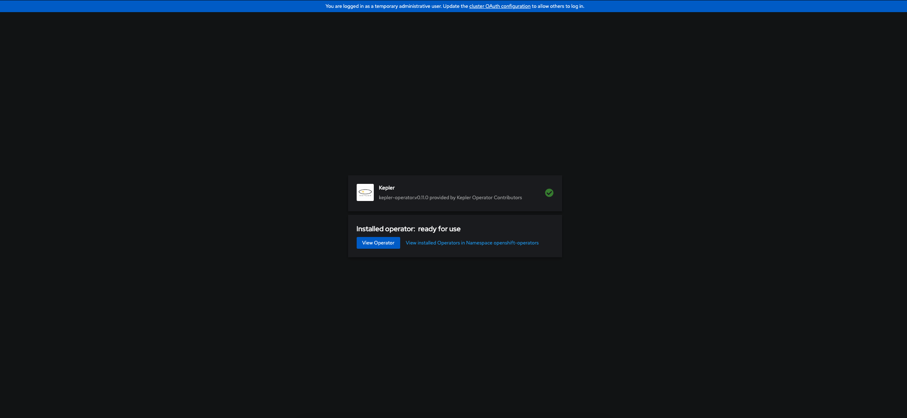
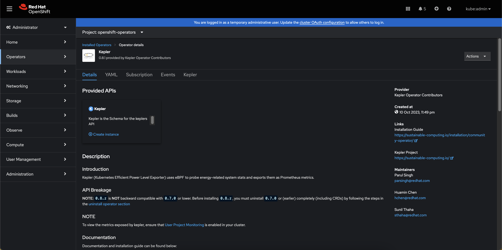
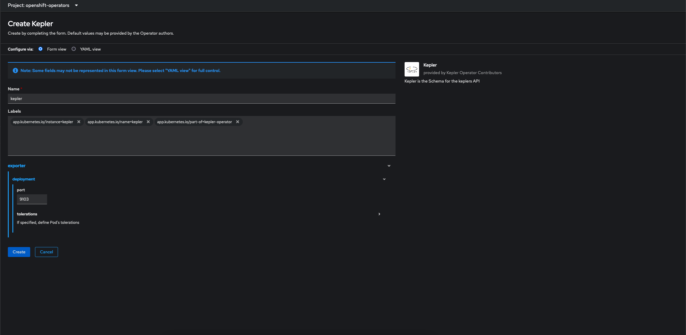
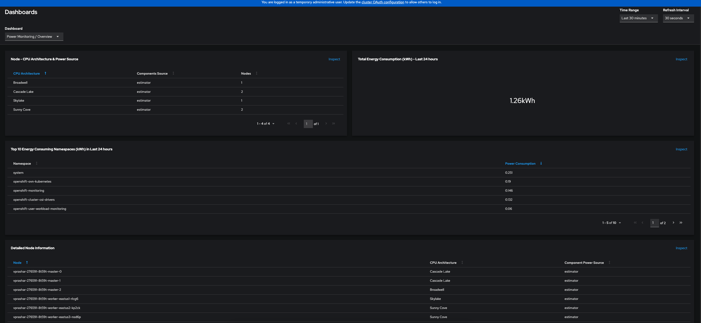
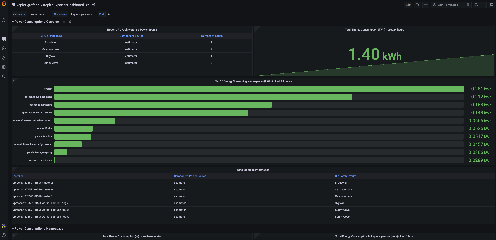
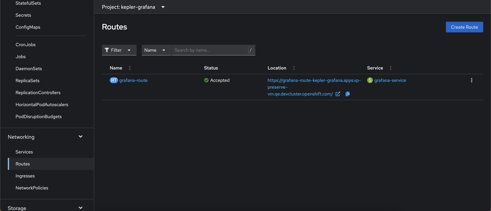

# Kepler Community Operator on OpenShift

## Requirements

Before you start make sure you have:

- An OCP 4.13 or above cluster running
- Signed in as `kubeadmin` or a user with `cluster-admin` role
- `oc` installed.
- Clone the [kepler-operator](https://github.com/sustainable-computing-io/kepler-operator/) repository.

    ```sh
    git clone https://github.com/sustainable-computing-io/kepler-operator.git
    cd kepler-operator
    ```

---

## Remove previously installed version of the Kepler Community Operator

If you have previously installed the Kepler Community Operator this will need
to be removed prior to the installation of the `v0.8.z` version or above of the operator.
This is due to changes to the Kepler API that are backward incompatible.
Please also note that `v1alpha1` does not promise backward compatibility and backward incompatible changes
are expected until the API matures to `v1beta1`.

To remove the Kepler Operator use the
[Uninstall Operator Script](https://github.com/sustainable-computing-io/kepler-operator/blob/v1alpha1/hack/uninstall-operator.sh)
in the [Kepler-Operator repo](https://github.com/sustainable-computing-io/kepler-operator)

- Run the uninstallation script to check the installed version of the operator

    ```sh
    ./hack/uninstall-operator.sh
    ```

    Sample output of the command

    ```sh
     🔔 No operator version specified; finding the installed version
       ✅ found kepler-operator csv: clusterserviceversion.operators.coreos.com/kepler-operator.v0.8.1
       ✅ kepler-operator version: v0.8.1
       ✅ Found - Kepler Operator version: v0.8.1
    
    
       🔆🔆🔆  Resources of Kepler Operator - v0.8.1  🔆🔆🔆
    ━━━━━━━━━━━━━━━━━━━━━━━━━━━━━━━━━━━━━━━━━━━━━━━━━━━━━━━━━━━━━
    NAME                     DISPLAY   VERSION   REPLACES                 PHASE
    kepler-operator.v0.8.1   Kepler    0.8.1     kepler-operator.v0.8.0   Succeeded
    
    
       🔆🔆🔆  Going to delete the following  🔆🔆🔆
    ━━━━━━━━━━━━━━━━━━━━━━━━━━━━━━━━━━━━━━━━━━━━━━━━━━━━━
     ❯ kubectl get ns kepler
    
    Error from server (NotFound): namespaces "kepler" not found
     ❯ kubectl get kepler -A
    
    NAME     PORT   DESIRED   CURRENT   READY   UP-TO-DATE   AVAILABLE   AGE
    kepler   9103   17        17        17      17           17          12h
     ❯ kubectl get -n openshift-operators olm -l operators.coreos.com/kepler-operator.openshift-operators=
    
    NAME                                                            AGE
    operatorcondition.operators.coreos.com/kepler-operator.v0.8.1   12h
    ....
    ━━━━━━━━━━━━━━━━━━━━━━━━━━━━━━━━━━━━━━━━━━━━━━━━━━
     🔔 To delete all resources listed above, rerun with the `--delete` option added.
    
             ./hack/uninstall-operator.sh  --delete
    ```

- Once the above is verified, uninstall the operator and all the related resources by specifying the --delete flag.

    ```sh
    ./hack/uninstall-operator.sh  --delete
    ```

---

## Install Kepler Community Operator from Operator Hub

- Go to Operators ❯ Operator Hub. Search for `Kepler`.
  Click on Kepler Operator tile, then select `Continue` and then `Install`

    

- Choose `alpha` channel to deploy the `latest` version of the Operator.

    > **From OCP 4.15 onwards operator can be installed on Namespaces other than `openshift-operators`**

- Click on `Install`

    

- Wait until Operator gets installed

    

    Follow the `View Operator` link to view installed Operators in `openshift-operators` Namespace
    or use the UI to navigate to installed operators and select the Kepler
    Operator.

- Select `Create instance` to Create a Custom Resource for Kepler

    

- There is a `Form` and `YAML` view, using the **YAML** view
  provides more detail.

    

    

- Once Kepler is configured select `Create`.

- Check that the Kepler is deployed and available

    ```sh
    oc get kepler kepler
    ```

    ```console
    NAME     PORT   DESIRED   CURRENT   READY   UP-TO-DATE   AVAILABLE   AGE
    kepler   9103   6         6         6       6            6           33s
    ```

---

## Kepler Dashboard

The Kepler Dashboard provides the ability to visualize data exported by Kepler thus facilitating data-driven insights and a clear and interactive overview of metrics.
Currently, we can visualize Kepler related metrics either via deploying Grafana dashboard on OpenShift or directly via OpenShift Console.

### OpenShift Console

To view the metrics directly from OpenShift Console

- Configure user workload monitoring on the cluster. Refer to the official OpenShift [documentation](https://docs.openshift.com/container-platform/latest/monitoring/enabling-monitoring-for-user-defined-projects.html) for more information.
- Navigate to Observe ❯ Dashboard
  - To view overall power consumption select `Power Monitoring / Overview` from the dropdown.
    
  - To view the power consumption by namespace select `Power Monitoring / Namespace` from the dropdown.
    

### Deploy the Grafana Dashboard

The Kepler dashboard can be installed using the
[deploy grafana script](https://github.com/sustainable-computing-io/kepler-operator/blob/v1alpha1/hack/dashboard/openshift/deploy-grafana.sh)
in the [kepler-operator repo](https://github.com/sustainable-computing-io/kepler-operator)

- Run the Grafana deployment script

    ```sh
    ./hack/dashboard/openshift/deploy-grafana.sh
    ```

The script takes a few minutes to complete. The script automates the following steps:

- Setup OpenShift User Workload Monitoring.
- Install the Grafana Community Operator inside `kepler-grafana` namespace
- Setup Grafana related dependencies e.g. ServiceAccount, Grafana DataSource, Grafana Dashboard and Route

When the script successfully completes it provides the OpenShift Route to the Kepler Dashboard.

```sh
   🔆🔆🔆  Grafana Dashboard Setup Complete  🔆🔆🔆
━━━━━━━━━━━━━━━━━━━━━━━━━━━━━━━━━━━━━━━━━━━━━━━━━━━━━━━━
  📈 Grafana Configuration:

   Dashboard URL: https://grafana-route-kepler-grafana.apps.devcluster.openshift.com/login
           Admin: kepler
        Password: kepler
━━━━━━━━━━━━━━━━━━━━━━━━━━━━━━━━━━━━━━━━━━━━━━━━━━━━━━━
 🔔 Kepler use prometheus deployed in openshift-user-workload-monitoring to store metrics. To configure Prometheus to cater to needs of the cluster such as:

    * Increase data retention for in-depth analysis
    * Allocate more resources based on requirements

💡 see: https://docs.openshift.com/container-platform/latest/monitoring/configuring-the-monitoring-stack.html#configuring-the-monitoring-stack_configuring-the-monitoring-stack

━━━━━━━━━━━━━━━━━━━━━━━━━━━━━━━━━━━━━━━━━━━━━━━━━━━━━━━
```

#### Grafana Dashboard

Sign in to the Grafana dashboard using the credentials `kepler:kepler`.



#### Access the Grafana Console Route

The dashboard can also be accessed through the OCP UI, Go to Networking ❯ Routes.



#### Grafana Deployment Overview

Refer to the [Grafana Deployment Overview](https://github.com/sustainable-computing-io/kepler-operator/blob/v1alpha1/docs/developer/assets/grafana-deployment-overview.png)


---

## Frequently Asked Questions

### Will Kepler work on earlier releases of OpenShift?

Our recommendation is use `OCP 4.13` and above, but Kepler can be installed on `OCP 4.11`
and `4.12`. In the future the Operator may be updated to check the version of
Kubernetes that is installed e.g. `v1.25`.

### How do I set nodeSelector and tolerations for Kepler?

You can specify **nodeSelector** and **toleration's** for Kepler at the time of creating Instance.
You can specify both in `Form` and `YAML` view.

To specify in `YAML` view:

```yaml
spec:
exporter:
  deployment:
    port: 9103
    nodeSelector:
      foo: bar
    tolerations:
      - key: foo
        operator: "Equal"
        value: bar
        effect: NoExecute
```

### How do I specify Redfish related configuration?

You can specify Redfish related configuration for Kepler at the time of creating Instance.
You can specify both in `Form` and `YAML` view.

To specify in `YAML` view:

```yaml
spec:
  exporter:
    deployment:
      port: 9103
      tolerations:
        - operator: Exists
    redfish:
      secretRef: redfish-secret
      probeInterval: 60s
      skipSSLVerify: false
```

!!! note
    Once an instance is created, the user must manually create redfish secret `redfish-secret` in the namespace `kepler-operator`.
    Once the secret is created, the operator will reconcile and Kepler will be able to connect to Redfish.

For more information regarding secret content specification refer to the [upstream manifest](https://raw.githubusercontent.com/sustainable-computing-io/kepler/main/manifests/config/exporter/redfish.csv).

### Where are Kepler exporter pods deployed?

Once a Kepler Instance is created all related resources like pods, daemonsets, configmaps, secrets etc. are present inside the `kepler-operator` namespace.
To view the available resources:

```sh
oc get all -n kepler-operator
```
