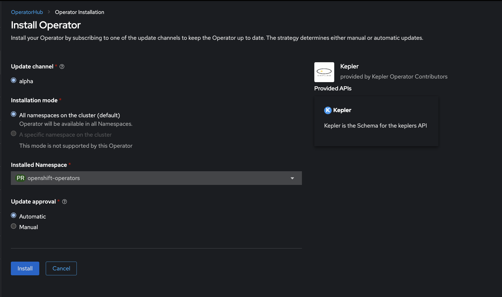
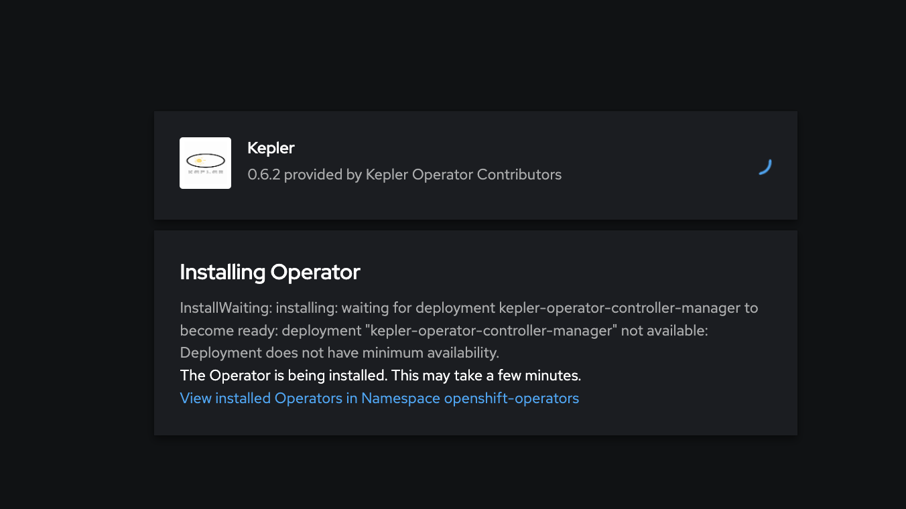
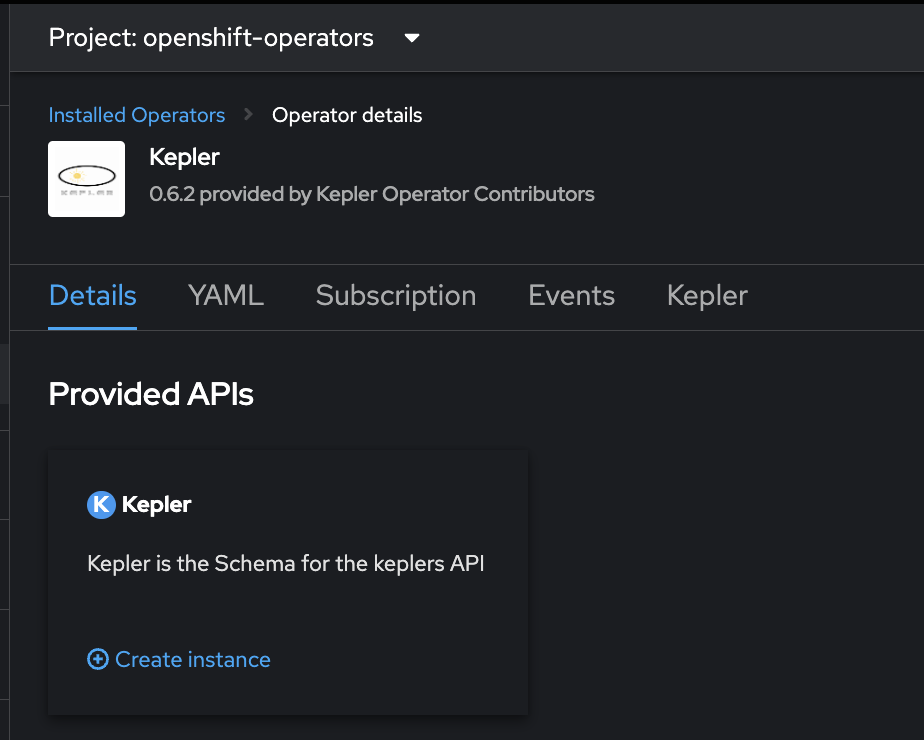
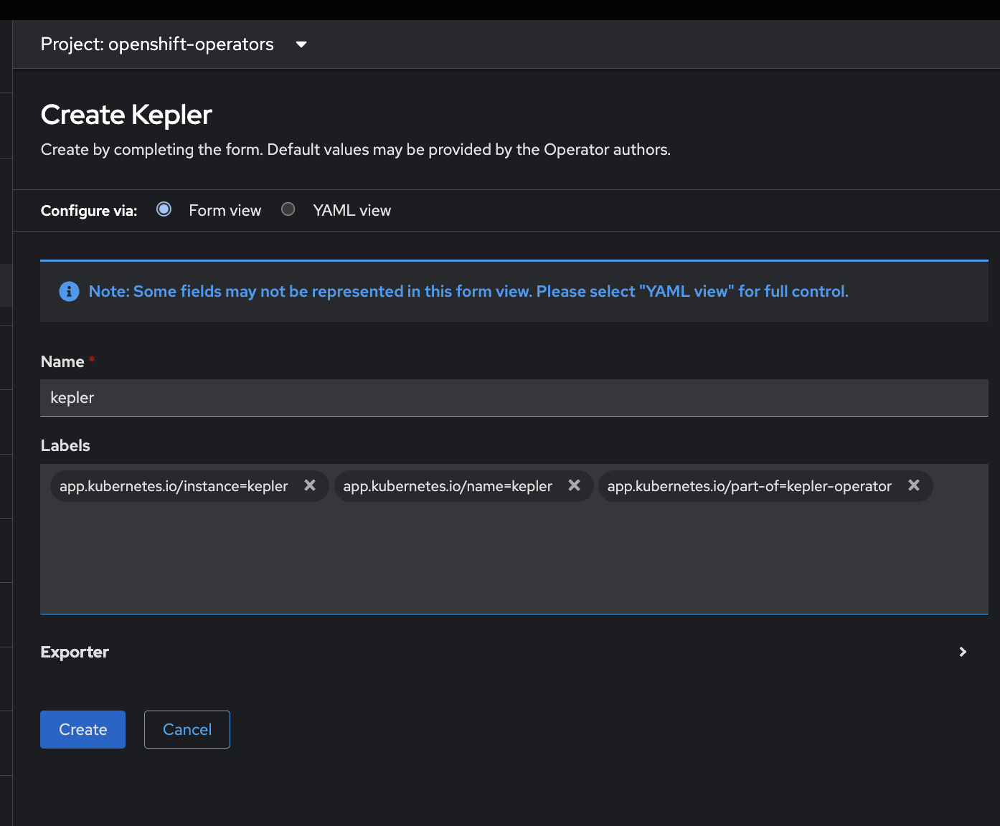
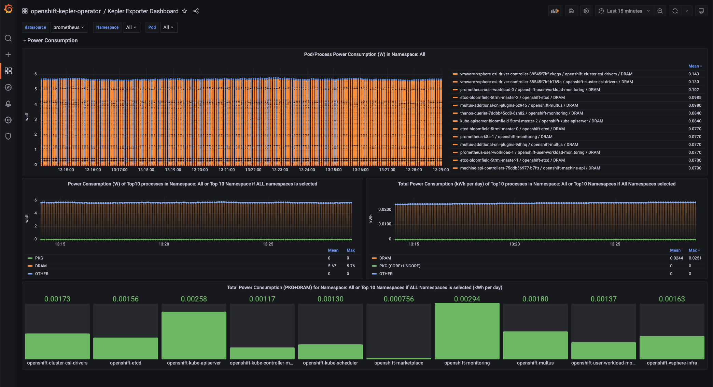

# Kepler Community Operator on OpenShift

## Requirements

Before you start make sure you have:

- An OCP 4.13 cluster running
- Signed in as `kubeadmin` or a user with `cluster-admin` role
- `oc` installed.
- Cloned the [kepler-operator](https://github.com/sustainable-computing-io/kepler-operator/) repository.
```sh
git clone https://github.com/sustainable-computing-io/kepler-operator.git
cd kepler-exporter
```

---

## Remove previously installed version of the Kepler Community Operator

If you have previously installed the Kepler Community Operator this will need to be removed prior to the installation of the v0.6.z version of the operator. This is due to updates to the Kepler API that not being backward compatible. 

To remove the Kepler Operator use the [Unistall Operator Script](https://github.com/sustainable-computing-io/kepler-operator/blob/v1alpha1/hack/uninstall-operator.sh) in the [Kepler-Operator repo](https://github.com/sustainable-computing-io/kepler-operator)

1. Run the install script to check the installed version of the operator

```shell
/hack/uninstall-operator.sh
```

Sample output of the command
```console

   🔆🔆🔆  Resources of Kepler Operator - v0.5.0  🔆🔆🔆
━━━━━━━━━━━━━━━━━━━━━━━━━━━━━━━━━━━━━━━━━━━━━━━━━━━━━━━━━━━━━
Error from server (NotFound): clusterserviceversions.operators.coreos.com "kepler-operator.v0.5.0" not found
 🔔 failed to find v0.5.0 of kepler-operator.
──────────────────────────────────────────────────
NAME                                  DISPLAY   VERSION              REPLACES   PHASE
kepler-operator.v0.5.0-230815081646   Kepler    0.5.0-230815081646              Succeeded
──────────────────────────────────────────────────
 🔔 kepler-operator version found are ☝️

```

2. To remove the exiting Kepler Community Operator use the following command, update the -v flag with the operator version that is installed. 

```shell
/hack/uninstall-operator.sh -v v0.5.0-230815081646 --delete
```

---
## Install Kepler Community Operator from Operator Hub

1. Go to Operators > OperatorHub. Search for `Kepler`. Click on Kepler Operator tile, then select `Continue` and then `Install` 


2. No changes need to be made to the operator install options, select `Install`



2. Allow the operator to install



Follow the link to `View installed Operators in Namespace openshift-operators` or use the UI to navigate to installed operators and select the Kepler Operator.  

3. Select `Create instance` to Create a Custom Resource for Kepler 



4. Select `Create`. There is a `Form` or `YAML` view, using the *YAML* view provides more detail. No changes need to be made. 




5. Check that the Kepler Exporter pods are running in the openshift-kepler-operator namespace

```shell
oc project openshift-kepler-operator
oc get pods
```
A kepler exporter pod should be running on node in the cluster

```console
NAME                       READY   STATUS    RESTARTS   AGE
kepler-exporter-ds-6j2wm   1/1     Running   0          21s
kepler-exporter-ds-6kd99   1/1     Running   0          21s
kepler-exporter-ds-6lh9x   1/1     Running   0          21s
```

---
## Installing Kepler Demo Dashboard

The Kepler Dashboard provides demonstration examples of Kepler data. The demo dashboard uses the Grafana Community Operator and some scalability issues have been seen.  

### Deploy the Grafana Operator

The Kepler demo dashboard is installed using the [deploy grafana script](https://github.com/sustainable-computing-io/kepler-operator/blob/v1alpha1/hack/dashboard/openshift/deploy-grafana.sh) in the [kepler-operator repo](https://github.com/sustainable-computing-io/kepler-operator)

1. Run the deploy grafana script

```shell
/hack/dashboard/openshift/deploy-grafana.sh
```

The script takes a few minutes to complete. The script automates the following stpes:

* Setup OpenShift User Project Monitoring
* Install the Grafana Community Operator
* Setup Grafana e.g. ServiceAccount, Grafan DataSource, Grafan Dashboard and Route

When the script successfully completes it provides the OpenShift Route to the Kepler Dashboard

```console
  🔆🔆🔆  Grafana Dashboard Setup Complete  🔆🔆🔆
━━━━━━━━━━━━━━━━━━━━━━━━━━━━━━━━━━━━━━━━━━━━━━━━━━━━━━━━
  📦 Cluster Monitoring Configuration
    Backup Directory: /Users/adrianhammond/coding_projects/kepler-operator/tmp/grafana-deployment


  📈 Grafana Configuration:

   Dashboard URL: https://grafana-route-openshift-kepler-operator.apps.bloomfield.demolab.local/login
           Admin: kepler
        Password: kepler
━━━━━━━━━━━━━━━━━━━━━━━━━━━━━━━━━━━━━━━━━━━━━━━━━━━━━━━
```
### Grafana Dashboard
Sign in to the Grafana dashboard using the credentials `kepler:kepler`.



### Access the Garafana Console Route
The dashboard can also be accessed through the OCP UI, Go to Networking > Routes.


---

## Frequently Asked Questions

# Will Kepler work on earlier releases of OpenShift

Our recommendation is use OCP 4.13 but Kepler has been installed on OCP 4.11 and 4.12. In the future the Operator might be updated to check the version of kubernetes that is installed e.g. v1.25. 

