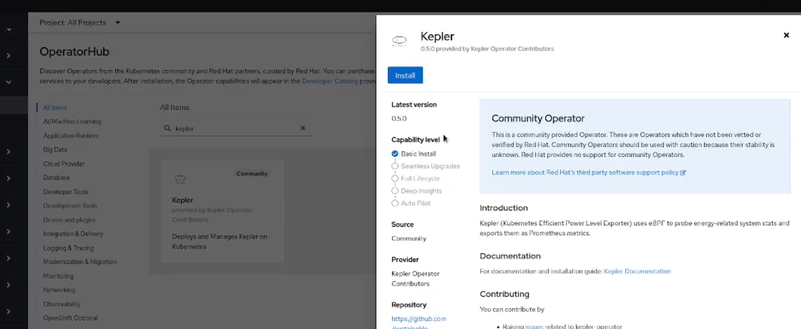
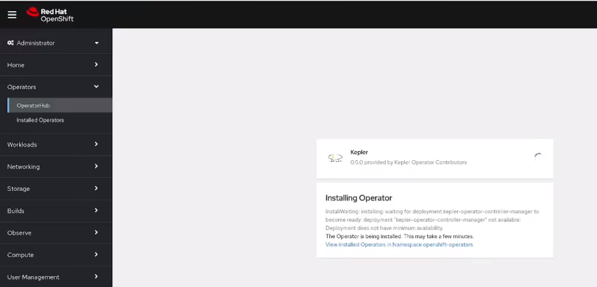
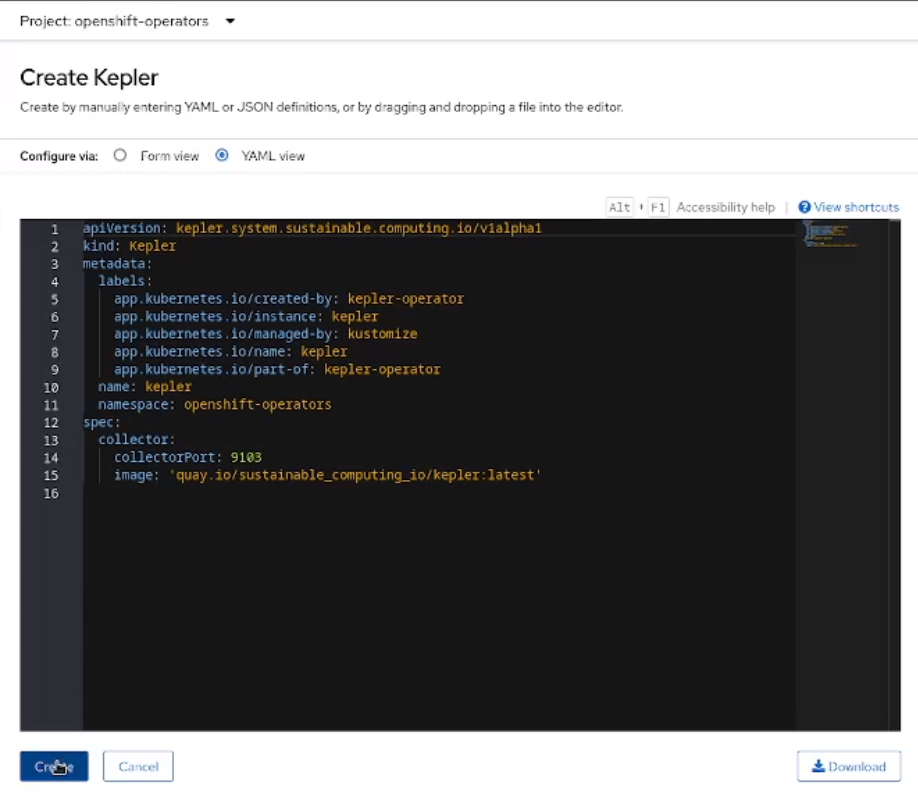
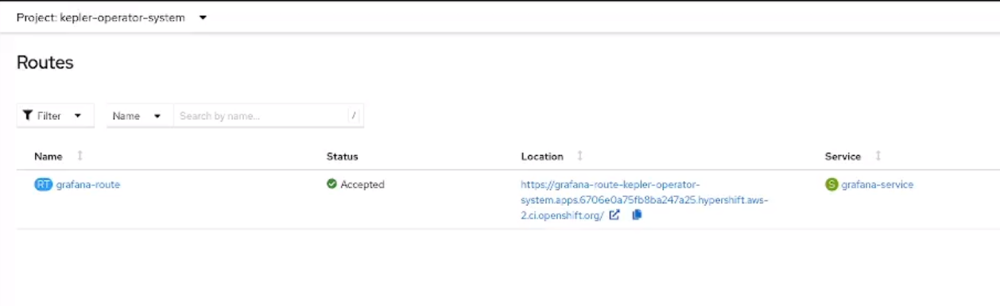
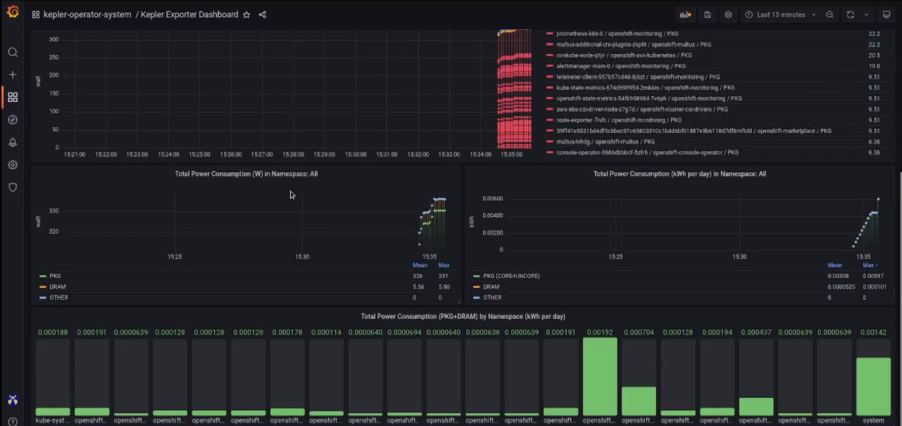
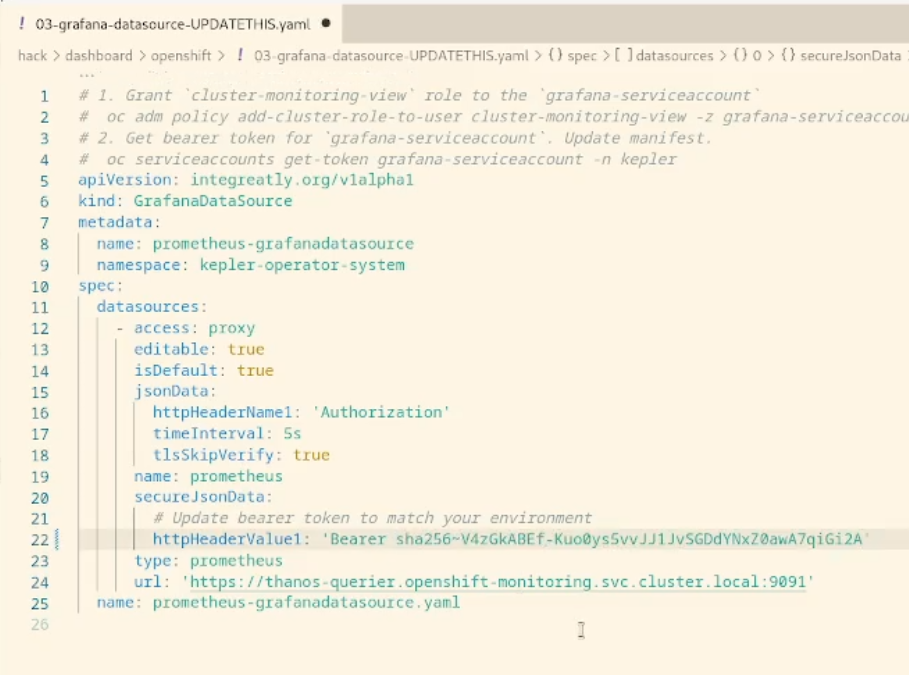

# Kepler Community Operator on OpenShift

## Requirements

Before you start make sure you have:

- An OCP 4.13 cluster running
- Signed in as `kubeadmin` or a user with `cluster-admin` role
- `oc` installed.
- Cloned the [kepler-operator](https://github.com/sustainable-computing-io/kepler-operator/) repository.
```sh
git clone https://github.com/sustainable-computing-io/kepler-operator.git
cd kepler-exporter
```
---
## Install operator from Operator Hub

1. Go to Operators > OperatorHub. Search for `Kepler`. Click on `Install` 


2. Allow the operator to install


3. Create a Custom Resource for Kepler 

> Note: The current OCP console may display a JavaScript error (expected to be fixed in 4.13.5), but it doesn't affect the rest of the steps. Fixes are currently available on the 4.13.0-0.nightly-2023-07-08-165124 build of OCP console.

---
## Installing the Grafana operator

### Deploy the Grafana Operator

The current API Bearer token needs to be updated in the `GrafanaDataSource` manifest so that the `GrafanaDataSource` can authenticate to the Prometheus. The following command will update the manifest and deploy Grafana Operator in the namespace `kepler-operator-system`

```sh
BEARER_TOKEN=$(oc whoami --show-token)
hack/dashboard/openshift/deploy-grafana.shhack/dashboard/openshift/deploy-grafana.sh
```
> Note: The script requires that you are in the top-level directory so make sure you are in `kepler-operator` root directory. Use command `cd $(git rev-parse --show-toplevel)`

### Access the Garafana Console Route
Go to Networking > Routes.


### Grafana Dashboard
Sign in to the Grafana dashboard using the credentials `kepler:kepler`.


---

## Troubleshooting

> Note: If there is an issue with the datasource check if the API token was updated correctly

