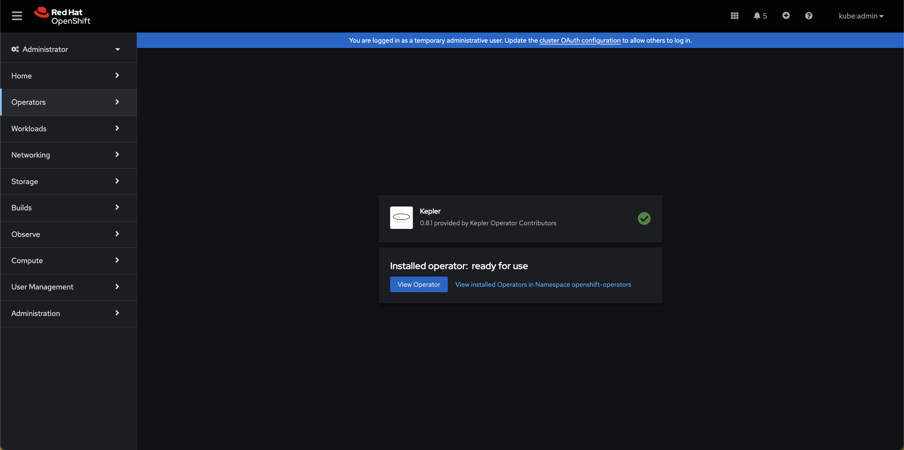
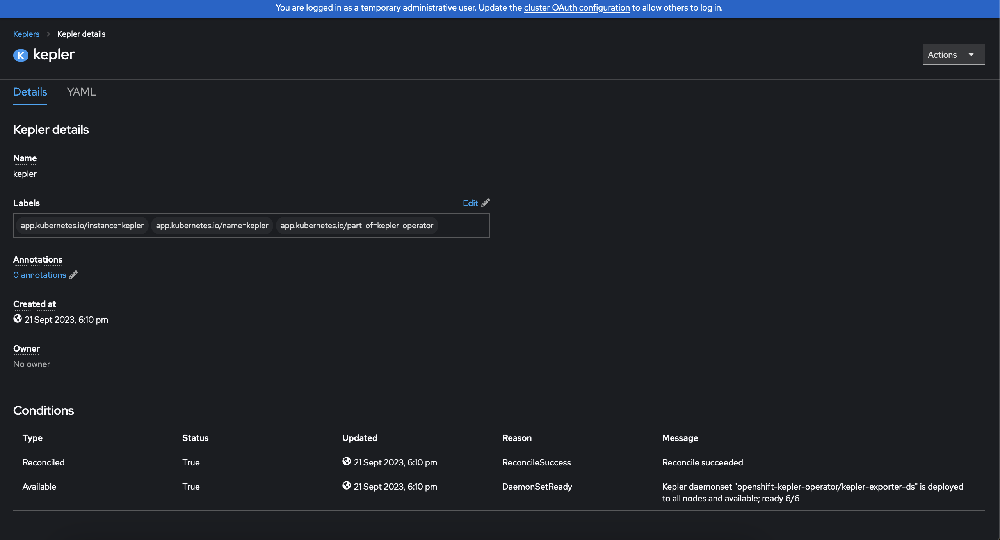
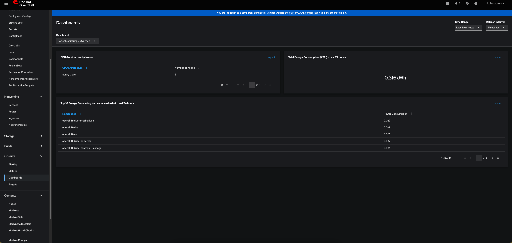
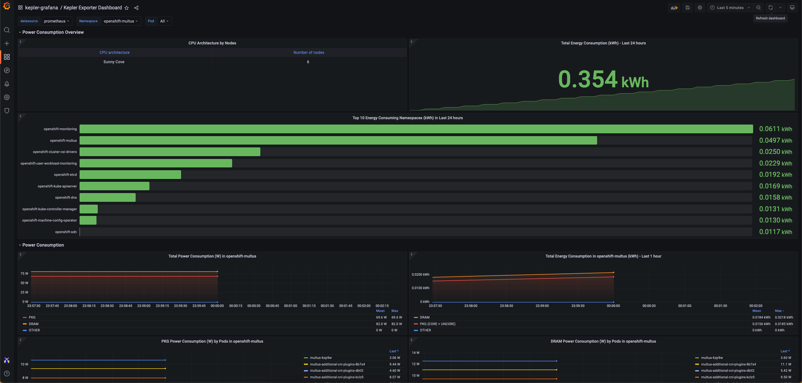

# Kepler Community Operator on OpenShift

## Requirements

Before you start make sure you have:

- An OCP 4.13 cluster running
- Signed in as `kubeadmin` or a user with `cluster-admin` role
- `oc` installed.
- Clone the [kepler-operator](https://github.com/sustainable-computing-io/kepler-operator/) repository.

```sh
git clone https://github.com/sustainable-computing-io/kepler-operator.git
cd kepler-operator
```

---

## Remove previously installed version of the Kepler Community Operator

If you have previously installed the Kepler Community Operator this will need
to be removed prior to the installation of the `v0.8.z` version of the operator.
This is due to changes to the Kepler API that are backward incompatible.
Please also note that `v1alpha` does not promise backward compatibility and backward incompatible changes are expected until the API matures to `v1beta1`.

To remove the Kepler Operator use the [Uninstall Operator Script](https://github.com/sustainable-computing-io/kepler-operator/blob/v1alpha1/hack/uninstall-operator.sh) in the [Kepler-Operator repo](https://github.com/sustainable-computing-io/kepler-operator)

- Run the uninstall script to check the installed version of the operator

```sh
./hack/uninstall-operator.sh
```

Sample output of the command

```sh
 🔔 No operator version specified; finding the installed version
   ✅ found kepler-operator csv: clusterserviceversion.operators.coreos.com/kepler-operator.v0.8.1
   ✅ kepler-operator version: v0.8.1
   ✅ Found - Kepler Operator version: v0.8.1


   🔆🔆🔆  Resources of Kepler Operator - v0.8.1  🔆🔆🔆
━━━━━━━━━━━━━━━━━━━━━━━━━━━━━━━━━━━━━━━━━━━━━━━━━━━━━━━━━━━━━
NAME                     DISPLAY   VERSION   REPLACES                 PHASE
kepler-operator.v0.8.1   Kepler    0.8.1     kepler-operator.v0.8.0   Succeeded


   🔆🔆🔆  Going to delete the following  🔆🔆🔆
━━━━━━━━━━━━━━━━━━━━━━━━━━━━━━━━━━━━━━━━━━━━━━━━━━━━━
 ❯ kubectl get ns kepler

Error from server (NotFound): namespaces "kepler" not found
 ❯ kubectl get kepler -A

NAME     PORT   DESIRED   CURRENT   READY   UP-TO-DATE   AVAILABLE   AGE
kepler   9103   17        17        17      17           17          12h
 ❯ kubectl get -n openshift-operators olm -l operators.coreos.com/kepler-operator.openshift-operators=

NAME                                                            AGE
operatorcondition.operators.coreos.com/kepler-operator.v0.8.1   12h
....
━━━━━━━━━━━━━━━━━━━━━━━━━━━━━━━━━━━━━━━━━━━━━━━━━━
 🔔 To delete all resources listed above, rerun with --delete option added.

         ./hack/uninstall-operator.sh  --delete
```

- Once the above is verified, uninstall the operator and all the related resources by specifying the --delete flag.

```sh
./hack/uninstall-operator.sh  --delete
```

---

## Install Kepler Community Operator from Operator Hub

- Go to Operators ❯ OperatorHub. Search for `Kepler`.
  Click on Kepler Operator tile, then select `Continue` and then `Install`


- Choose `alpha` or `dev-preview` channel for deploying the `latest` or the `developer preview` version of the Operator respectively.
- Click on `Install`

**NOTE:** `dev-preview` channel will only be updated until developer-preview is finalized.


- Wait until Operator gets installed



Follow the link to view installed Operators in `openshift-operators` Namespace
or use the UI to navigate to installed operators and select the Kepler
Operator.

- Select `Create instance` to Create a Custom Resource for Kepler


- There is a `Form` and `YAML` view, using the **YAML** view
  provides more detail.


- Once Kepler is configured select `Create`.

* Check that the Availability status of Kepler Instance should be `True`



- Check that the Kepler is deployed and available

```sh
oc get kepler kepler
```

```console
NAME     PORT   DESIRED   CURRENT   READY   UP-TO-DATE   AVAILABLE   AGE
kepler   9103   6         6         6       6            6           33s
```

---

## Kepler Dashboard

The Kepler Dashboard provides the ability to visualize data exported by Kepler thus facilitating data-driven insights and a clear and interactive overview of metrics.
Currently, we can visualize Kepler related metrics either via deploying Grafana dashboard on OpenShift or directly via OpenShift Console.

### OpenShift Console

To view the metrics directly from OpenShift Console

- Configure user workload monitoring on the cluster. Refer to the official OpenShift [documentation](https://docs.openshift.com/container-platform/latest/monitoring/enabling-monitoring-for-user-defined-projects.html) for more information.
- Navigate to Observe ❯ Dashboard
  - To view overall power consumption select `Power Monitoring / Overview` from dropdown.
    
  - To view the power consumption by namespace select `Power Monitoring / Namespace` from dropdown.
    

### Deploy the Grafana Dashboard

The Kepler dashboard can be installed using the [deploy grafana script](https://github.com/sustainable-computing-io/kepler-operator/blob/v1alpha1/hack/dashboard/openshift/deploy-grafana.sh)
in the [kepler-operator repo](https://github.com/sustainable-computing-io/kepler-operator)

- Run the Grafana deployment script

```sh
./hack/dashboard/openshift/deploy-grafana.sh
```

The script takes a few minutes to complete. The script automates the following steps:

- Setup OpenShift User Workload Monitoring.
- Install the Grafana Community Operator inside `kepler-grafana` namespace
- Setup Grafana related dependencies e.g. ServiceAccount, Grafana DataSource, Grafana Dashboard and Route

When the script successfully completes it provides the OpenShift Route to the Kepler Dashboard.

```sh
   🔆🔆🔆  Grafana Dashboard Setup Complete  🔆🔆🔆
━━━━━━━━━━━━━━━━━━━━━━━━━━━━━━━━━━━━━━━━━━━━━━━━━━━━━━━━
  📈 Grafana Configuration:

   Dashboard URL: https://grafana-route-kepler-grafana.apps.devcluster.openshift.com/login
           Admin: kepler
        Password: kepler
━━━━━━━━━━━━━━━━━━━━━━━━━━━━━━━━━━━━━━━━━━━━━━━━━━━━━━━
 🔔 Kepler use prometheus deployed in openshift-user-workload-monitoring to store metrics. To configure Prometheus to cater to needs of the cluster such as:

    * Increase data retention for in-depth analysis
    * Allocate more resources based on requirements

💡 see: https://docs.openshift.com/container-platform/latest/monitoring/configuring-the-monitoring-stack.html#configuring-the-monitoring-stack_configuring-the-monitoring-stack

━━━━━━━━━━━━━━━━━━━━━━━━━━━━━━━━━━━━━━━━━━━━━━━━━━━━━━━
```

#### Grafana Dashboard

Sign in to the Grafana dashboard using the credentials `kepler:kepler`.



#### Access the Grafana Console Route

The dashboard can also be accessed through the OCP UI, Go to Networking ❯ Routes.


#### Grafana Deployment Overview

Refer to the [Grafana Deployment Overview](https://github.com/sustainable-computing-io/kepler-operator/blob/v1alpha1/docs/developer/assets/grafana-deployment-overview.png)


---

## Frequently Asked Questions

### Will Kepler work on earlier releases of OpenShift?

Our recommendation is use `OCP 4.13` but Kepler has been installed on `OCP 4.11`
and `4.12`. In future the Operator may be updated to check the version of
kubernetes that is installed e.g. `v1.25`.

### How do I set nodeSelector and tolerations for Kepler?

You can specify **nodeSelector** and **toleration's** for Kepler at the time of creating Instance. You can specify both in `Form` and `YAML` view.

- To specify in `YAML` view:

```yaml
spec:
exporter:
  deployment:
    port: 9103
    nodeSelector:
      foo: bar
    tolerations:
      - key: foo
        operator: "Equal"
        value: bar
        effect: NoExecute
```

### Where is Kepler exporter pods deployed?

Once Kepler Instance is created all the related resources like pods, daemonsets, configmaps, secret's etc. are present inside `openshift-kepler-operator` namespace. To view the available resources:

```sh
oc get all -n openshift-kepler-operator
```

### How do I enable libbpf images?

**NOTE:** This annotation will only exist until Kepler `0.7` is released which will default to `libbpf` and discontinue `bcc`

You can specify **annotations** for Kepler at the time of creating the Instance.

To specify in `YAML` view:

```yaml
metadata:
  annotations:
    kepler.sustainable.computing.io/bpf-attach-method: bcc/libbpf
```

Here `bcc` requires OCP 4.13 and above whereas `libbpf` can work with OCP 4.13 or below.
