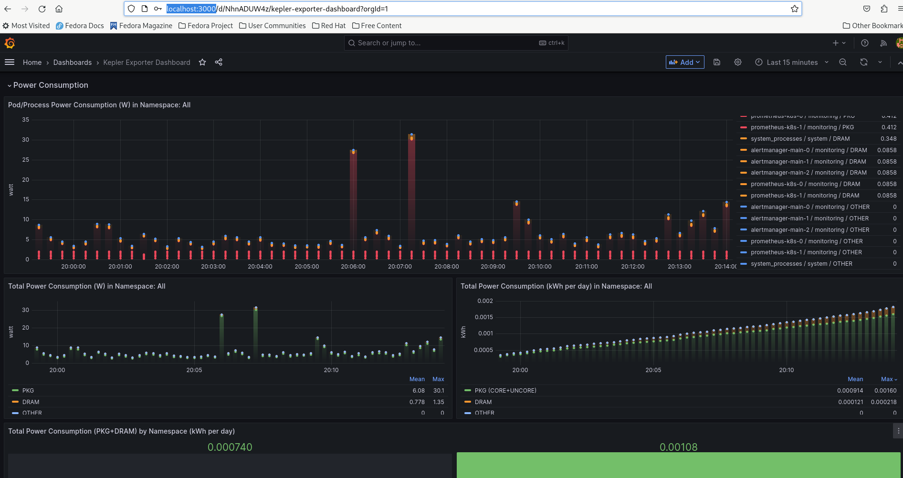

# Kepler Operator on Kind

## Requirements:

Before you start make sure you have:

- `kubectl` installed
- Clone the `kepler-operator`[repository](https://github.com/sustainable-computing-io/kepler-operator)  
- You’ll need a Kubernetes cluster to run against. You can use KIND to get a [local cluster for testing](#run-a-kind-cluster-locally), or run against a remote cluster. Note: Your controller will automatically use the current context in your kubeconfig file (i.e. whatever cluster kubectl cluster-info shows).
- Signed in as `kubeadmin` or a user with `cluster-admin` role


### Run a kind cluster locally

``` sh
cd kepler-operator
make cluster-up CLUSTER_PROVIDER='kind' CI_DEPLOY=true GRAFANA_ENABLE=true

kubectl get pods -n monitoring

grafana-b88df6989-km7c6                1/1     Running   0          48m
prometheus-k8s-0                       2/2     Running   0          46m
prometheus-operator-6bd88c8bdf-9f69h   2/2     Running   0          48m
```

## Run kepler-operator
- You can use the image from quay.io to deploy kepler-operator.

```sh
make deploy IMG=quay.io/sustainable_computing_io/kepler-operator:latest
kubectl config set-context --current --namespace=monitoring
kubectl apply -k config/samples/
```
- Verify `kepler-exporter` pods using the command `kubectl get pods -n monitoring`


## Set up Grafana Dashboard

Using `GRAFANA_ENABLE=true` configured the `kube-prometheus` monitoring stack in the namesapce `monitoring`.
To access the Grafana Console locally on the browser port-forward on 3000 using the following command:

```sh
kubectl port-forward svc/grafana 3000:3000 -n monitoring
```

>Note: Grafana Console can be accessed on [http://localhost:3000](http://localhost:3000)

### Service Monitor

For `kube-prometheus` to scrape `kepler-exporter` service endpoint you need to configure a service monitor.

> Note: By default `kube-prometheus` does not let you scrape services deployed in namespaces other than `monitoring`. So if you are running kepler outside `monitoring` [follow this to set up prometheus to scrape all namespaces](#scrape-all-namespaces).

```
kubectl apply -n monitoring -f - <<
apiVersion: monitoring.coreos.com/v1
kind: ServiceMonitor
metadata:
  labels:
    app.kubernetes.io/component: exporter
    app.kubernetes.io/name: kepler-exporter
    sustainable-computing.io/app: kepler
  name: monitor-kepler-exporter
spec:
  endpoints:
  - interval: 3s
    port: http
    relabelings:
    - action: replace
      regex: (.*)
      replacement: $1
      sourceLabels:
      - __meta_kubernetes_pod_node_name
      targetLabel: instance
    scheme: http
  jobLabel: app.kubernetes.io/name
  namespaceSelector:
    matchNames:
    any: true
  selector:
    matchLabels:
      app.kubernetes.io/component: exporter
      app.kubernetes.io/name: kepler-exporter
EOF
```

### Grafana Dashboard

To set up the grafana dashboard follow these steps:

- Sign in [localhost:3000](http:localhost:3000) using `admin:admin`
- Import default [dashboard](https://raw.githubusercontent.com/sustainable-computing-io/kepler/main/grafana-dashboards/Kepler-Exporter.json) from kepler repository



### Uninstall the operator
To delete the CRDs from the cluster:
```sh
make undeploy
```


To run Kepler operator on a kind cluster [follow](https://github.com/sustainable-computing-io/kepler-operator#getting-started) 

## Troubleshooting

### Scrape all namespaces

kube-prometheus by default does not let you scrape services in namespaces outside `monitoring`. This is controlled by RBAC.
The clusterrole `prometheus-k8s` should have below policy to scrape services in all namespaces.

```sh
oc describe clusterrole prometheus-k8s
Name:         prometheus-k8s
Labels:       app.kubernetes.io/component=prometheus
              app.kubernetes.io/instance=k8s
              app.kubernetes.io/name=prometheus
              app.kubernetes.io/part-of=kube-prometheus
              app.kubernetes.io/version=2.45.0
Annotations:  <none>
PolicyRule:
  Resources                    Non-Resource URLs  Resource Names  Verbs
  ---------                    -----------------  --------------  -----
  endpoints                    []                 []              [get list watch]
  pods                         []                 []              [get list watch]
  services                     []                 []              [get list watch]
  ingresses.networking.k8s.io  []                 []              [get list watch]
                               [/metrics]         []              [get]
  nodes/metrics                []                 []              [get]

```

- To customize the prometheus after creating [local cluster](#run-a-kind-cluster-locally) follow kube-prometheus documentation on [Customizing Kube-Prometheus](https://github.com/prometheus-operator/kube-prometheus/blob/main/docs/customizing.md)

- Make sure you apply [this jsonnet](https://github.com/prometheus-operator/kube-prometheus/blob/main/docs/customizations/monitoring-all-namespaces.md) to ensure Prometheus scrapes services in all namespaces.
