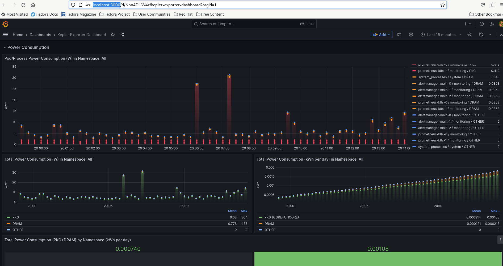

# 通过Kepler Operator在Kind上安装

## 需求:

在开始前请确认您已经安装了:

- `kubectl`
- 下载了`kepler-operator`[repository](https://github.com/sustainable-computing-io/kepler-operator)  
- 目标k8s集群。您可以使用Kind来简单构建一个本地k8s集群来体验本教程。[local cluster for testing](#run-a-kind-cluster-locally), 或直接在您远端的k8s集群执行。注意您的controller将会自动使用当前的kubeconfig配置文件。您可以通过`kubectl cluster-info`来查看。
- 有`kubeadmin` 或者 `cluster-admin` 权限的用户。

### 启动一个本地kind集群

``` sh
cd kepler-operator
make cluster-up CLUSTER_PROVIDER='kind' CI_DEPLOY=true GRAFANA_ENABLE=true

kubectl get pods -n monitoring

grafana-b88df6989-km7c6                1/1     Running   0          48m
prometheus-k8s-0                       2/2     Running   0          46m
prometheus-operator-6bd88c8bdf-9f69h   2/2     Running   0          48m
```

## 启动kepler-operator
- 您可以通过quay.io上的image来部署kepler-operator.

```sh
make deploy IMG=quay.io/sustainable_computing_io/kepler-operator:latest
kubectl config set-context --current --namespace=monitoring
kubectl apply -k config/samples/
```
- 通过`kubectl get pods -n monitoring`命令来验证`kepler-exporter`pod的部署情况。


## 设置Grafana Dashboard

使用`GRAFANA_ENABLE=true` 来配置`kube-prometheus`在命名空间`monitoring`上的部署.
通过以下命令来访问位于3000端口的grafana界面。

```sh
kubectl port-forward svc/grafana 3000:3000 -n monitoring
```

>并通过以下域名访问[http://localhost:3000](http://localhost:3000)

### Service Monitor

让`kube-prometheus` 使用 `kepler-exporter` 服务端口进行监控，您需要配置service monitor.

> Note: 默认情况下`kube-prometheus` 不会捕捉`monitoring`命名空间之外的服务. 如果您的kepler部署在`monitoring`空间之外[请看考以下步骤](#scrape-all-namespaces).

```
kubectl apply -n monitoring -f - <<
apiVersion: monitoring.coreos.com/v1
kind: ServiceMonitor
metadata:
  labels:
    app.kubernetes.io/component: exporter
    app.kubernetes.io/name: kepler-exporter
    sustainable-computing.io/app: kepler
  name: monitor-kepler-exporter
spec:
  endpoints:
  - interval: 3s
    port: http
    relabelings:
    - action: replace
      regex: (.*)
      replacement: $1
      sourceLabels:
      - __meta_kubernetes_pod_node_name
      targetLabel: instance
    scheme: http
  jobLabel: app.kubernetes.io/name
  namespaceSelector:
    matchNames:
    any: true
  selector:
    matchLabels:
      app.kubernetes.io/component: exporter
      app.kubernetes.io/name: kepler-exporter
EOF
```

### Grafana Dashboard

通过以下步骤配置Grafana:

- 登陆[localhost:3000](http:localhost:3000)默认用户名/密码为`admin:admin`
- 倒入默认[dashboard](https://raw.githubusercontent.com/sustainable-computing-io/kepler/main/grafana-dashboards/Kepler-Exporter.json)



### 卸载operator
通过以下命令卸载:
```sh
make undeploy
```

[参考这里](https://github.com/sustainable-computing-io/kepler-operator#getting-started) 来让kepler operator运行在kind集群上。

## 错误排查

### 监控所有的命名空间

kube-prometheus默认不会监控所有的命名空间，这是由于RBAC控制的。
以下clusterrole `prometheus-k8s`的配置讲允许kube-prometheus监控所有命名空间。

```sh
oc describe clusterrole prometheus-k8s
Name:         prometheus-k8s
Labels:       app.kubernetes.io/component=prometheus
              app.kubernetes.io/instance=k8s
              app.kubernetes.io/name=prometheus
              app.kubernetes.io/part-of=kube-prometheus
              app.kubernetes.io/version=2.45.0
Annotations:  <none>
PolicyRule:
  Resources                    Non-Resource URLs  Resource Names  Verbs
  ---------                    -----------------  --------------  -----
  endpoints                    []                 []              [get list watch]
  pods                         []                 []              [get list watch]
  services                     []                 []              [get list watch]
  ingresses.networking.k8s.io  []                 []              [get list watch]
                               [/metrics]         []              [get]
  nodes/metrics                []                 []              [get]

```

- 在创建[local cluster](#run-a-kind-cluster-locally)定制prometheus，请参考
kube-prometheus文档[Customizing Kube-Prometheus](https://github.com/prometheus-operator/kube-prometheus/blob/main/docs/customizing.md)

- 请确定您应用了[this jsonnet](https://github.com/prometheus-operator/kube-prometheus/blob/main/docs/customizations/monitoring-all-namespaces.md)保证prometheus监控所有命名空间。
