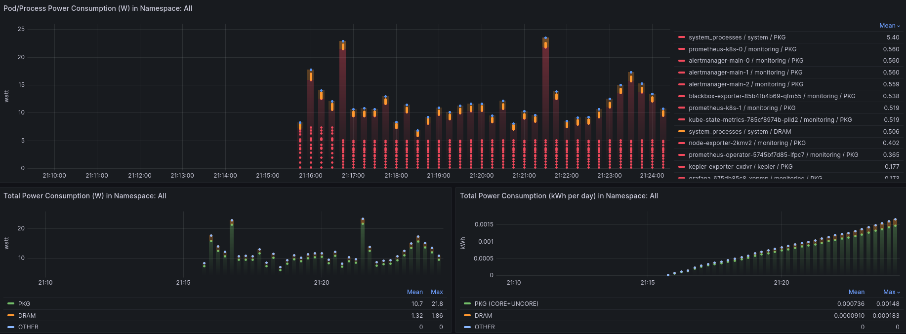

# Kepler Installation
## Requirements
- Kernel 4.18+
- `kubectl` v1.21.0+

## Deployments
### Local cluster

Kepler runs on Kubernetes. If you already have access to a cluster, you can skip this section. To deploy a local cluster, you can use [kind](https://kind.sigs.k8s.io/). `kind` is a tool for running local Kubernetes clusters using Docker container "nodes". It was primarily designed for testing Kubernetes itself, but may be used for local development or CI.

To install `kind`, please [see the instructions here](https://kind.sigs.k8s.io/docs/user/quick-start/#installation). 

We need to configure our cluster to run Kepler. Specifically, we need to mount `/proc` (to expose information about processes running on the host) and `/usr/src` (to expose kernel headers allowing dynamic eBPF program compilation - this dependency [might be removed in future releases](https://github.com/sustainable-computing-io/kepler/issues/716)) into the node containers. Below is a minimal single-node example configuration:

```yaml
# ./local-cluster-config.yaml
kind: Cluster
apiVersion: kind.x-k8s.io/v1alpha4
name: my-cluster
nodes:
- role: control-plane
  image: kindest/node:v1.27.3@sha256:3966ac761ae0136263ffdb6cfd4db23ef8a83cba8a463690e98317add2c9ba72
  extraMounts:
  - hostPath: /proc
    containerPath: /proc-host
  - hostPath: /usr/src
    containerPath: /usr/src
```

We can then spin up a cluster with:

```sh
export $CLUSTER_NAME="my-cluster"  # we can use the --name flag to override the name in our config
kind create cluster --name=$CLUSTER_NAME --config=./local-cluster-config.yaml
```

Note that `kind` automatically switches your current `kubeconfig` context to the newly created cluster.

#### Running Kepler on a local kind cluster

To run Kepler on `kind`, we need to build it locally with specific flags. The full details of local builds are covered in the section below. To deploy to a local `kind` cluster, you need to use the `CI_DEPLOY` and `PROMETHEUS_DEPLOY` flags:

```sh
git clone --depth 1 git@github.com:sustainable-computing-io/kepler.git
cd ./kepler
make build-manifest OPTS="CI_DEPLOY PROMETHEUS_DEPLOY"
kubectl apply -f _output/generated-manifest/deployment.yaml
```

#### Monitoring stack on a local kind cluster

You can follow the same steps listed in the [Prometheus deployment section below](https://sustainable-computing.io/installation/kepler/#deploy-the-prometheus-operator-and-the-whole-monitoring-stack) to deploy Prometheus and Grafana to the `kind` cluster.

The default Grafana deployment can be accessed with the credentials `admin:admin`.

You can expose the web-based UI locally using: 

```sh
kubectl -n monitoring port-forward svc/grafana 3000
```

Login with the credentials mentioned above. You can skip the window where Grafana asks to input a new password. If you followed the Kepler dashboard deployment steps, you can access the Kepler dashboard by navigating to http://localhost:3000/d/NhnADUW4z/kepler-exporter-dashboard.



### Deploy using Helm Chart

The Kepler Helm Chart is available on [GitHub](https://github.com/sustainable-computing-io/kepler-helm-chart/tree/main) and [ArtifactHub](https://artifacthub.io/packages/helm/kepler/kepler)

For Installation [Helm](https://helm.sh) must be installed to use the charts.
Please refer to Helm's [documentation](https://helm.sh/docs/) to get started.

The chart is accessible using the following commands:

Add the helm repo

```bash
helm repo add kepler https://sustainable-computing-io.github.io/kepler-helm-chart
```

You can see the latest version by using the folllowing command:

```bash
helm search repo kepler
```

If you would like to test and look at the manifest files before deploying you can run:

```bash
helm install kepler kepler/kepler --namespace kepler --create-namespace --dry-run --devel
```

Then to install run the following:

```bash
helm install kepler kepler/kepler --namespace kepler --create-namespace
```

You may want to override [values.yaml](https://github.com/sustainable-computing-io/kepler-helm-chart/blob/main/chart/kepler/values.yaml) file use the following command.

```bash
helm install kepler kepler/kepler --values values.yaml --namespace kepler --create-namespace
```

The following table lists the configurable parameters for this chart and their default values.

Parameter|Description| Default
---|---|---
global.namespace| Kubernete namespace for kepler |kepler
image.repository|Repository for Kepler Image| quay.io/sustainable\_computing\_io/kepler
image.pullPolicy|Pull policy for Kepler|Always
image.tag|Image tag for Kepler Image |latest
serviceAccount.name|Service acccount name for Kepler|kepler-sa
service.type|Kepler service type|ClusterIP
service.port|Kepler service exposed port|9102

#### Uninstall Kepler
To uninstall this chart, use the following steps

```bash
helm delete --purge kepler --tiller-namespace <namespace>
```

### Deploy from source code
Follow the steps below to deploy the Kepler exporter as a Daemonset to run on all Nodes. The following deployment will also create a service listening on port `9102`.

First, fork the [kepler](https://github.com/sustainable-computing-io/kepler) repository and clone it.

Then, build the manifests file that suit your environment and deploy it with the following steps:

#### Build manifests
```bash
make build-manifest OPTS="<deployment options>"
# minimum deployment: 
# > make build-manifest
# deployment with sidecar on openshift: 
# > make build-manifest OPTS="ESTIMATOR_SIDECAR_DEPLOY OPENSHIFT_DEPLOY"
```
Manifests will be generated in  `_output/manifests/kubernetes/generated/` by default.

Deployment Option|Description|Dependency
---|---|---
BM_DEPLOY|baremetal deployment patched with node selector feature.node.kubernetes.io/cpu-cpuid.HYPERVISOR to not exist|-
OPENSHIFT_DEPLOY|patch openshift-specific attribute to kepler daemonset and deploy SecurityContextConstraints|-
PROMETHEUS_DEPLOY|patch prometheus-related resource (ServiceMonitor, RBAC role, rolebinding) |require prometheus deployment which can be OpenShift integrated or [custom deploy](https://github.com/sustainable-computing-io/kepler#deploy-the-prometheus-operator-and-the-whole-monitoring-stack)
CLUSTER_PREREQ_DEPLOY|deploy prerequisites for kepler on openshift cluster| OPENSHIFT_DEPLOY option set
CI_DEPLOY|update proc path for kind cluster using in CI|-
ESTIMATOR_SIDECAR_DEPLOY|patch estimator sidecar and corresponding configmap to kepler daemonset|-
MODEL_SERVER_DEPLOY|deploy model server and corresponding configmap to kepler daemonset|-
TRAIN_DEPLOY|patch online-trainer sidecar to model server| MODEL_SERVER_DEPLOY option set
 -  build-manifest requirements:
    -  kubectl v1.21+
    -  make
    -  go
 -  manifest sources and outputs will be in  `_output/generated-manifest` by default


#### Deploy using Kubectl

```
# kubectl apply -f _output/generated-manifest/deployment.yaml
```

## Deploy the Prometheus operator (bundled with Grafana)

If Prometheus is already installed in the cluster, skip this step. Otherwise, follow these steps to install it.

1. Clone the [kube-prometheus](https://github.com/prometheus-operator/kube-prometheus) project to your local folder, and enter the `kube-prometheus` directory.

```sh
git clone --depth 1 https://github.com/prometheus-operator/kube-prometheus
cd kube-prometheus
```

2. This step is optional. You can later manually add the [Kepler Grafana dashboard](https://raw.githubusercontent.com/sustainable-computing-io/kepler/main/grafana-dashboards/Kepler-Exporter.json) through the Grafana UI. To automatically do that, fetch the `kepler-exporter` Grafana dashboard and inject in the Prometheus Grafana deployment. This step uses [yq](https://github.com/mikefarah/yq), a YAML processor:

```sh
KEPLER_EXPORTER_GRAFANA_DASHBOARD_JSON=`curl -fsSL https://raw.githubusercontent.com/sustainable-computing-io/kepler/main/grafana-dashboards/Kepler-Exporter.json | sed '1 ! s/^/         /'`
mkdir -p grafana-dashboards
cat > ./grafana-dashboards/kepler-exporter-configmap.yaml<<-EOF
apiVersion: v1
data:
    kepler-exporter.json: |-
        $KEPLER_EXPORTER_GRAFANA_DASHBOARD_JSON
kind: ConfigMap
metadata:
    labels:
        app.kubernetes.io/component: grafana
        app.kubernetes.io/name: grafana
        app.kubernetes.io/part-of: kube-prometheus
        app.kubernetes.io/version: 9.5.3
    name: grafana-dashboard-kepler-exporter
    namespace: monitoring
EOF
yq -i e '.items += [load("./grafana-dashboards/kepler-exporter-configmap.yaml")]' ./manifests/grafana-dashboardDefinitions.yaml
yq -i e '.spec.template.spec.containers.0.volumeMounts += [ {"mountPath": "/grafana-dashboard-definitions/0/kepler-exporter", "name": "grafana-dashboard-kepler-exporter", "readOnly": false} ]' ./manifests/grafana-deployment.yaml
yq -i e '.spec.template.spec.volumes += [ {"configMap": {"name": "grafana-dashboard-kepler-exporter"}, "name": "grafana-dashboard-kepler-exporter"} ]' ./manifests/grafana-deployment.yaml
```

3. Finally, apply the objects in the `manifests` directory. This will create the `monitoring` namespace and CRDs, and then wait for them to be available before creating the remaining resources. During the `until` loop, a response of `No resources found` is to be expected. This statement checks whether the resource API is created but doesn't expect the resources to be there.

```sh
kubectl apply --server-side -f manifests/setup
until kubectl get servicemonitors --all-namespaces ; do date; sleep 1; echo ""; done
kubectl apply -f manifests/
```
