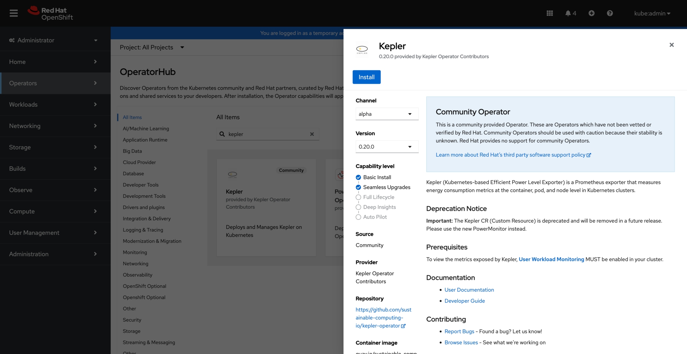
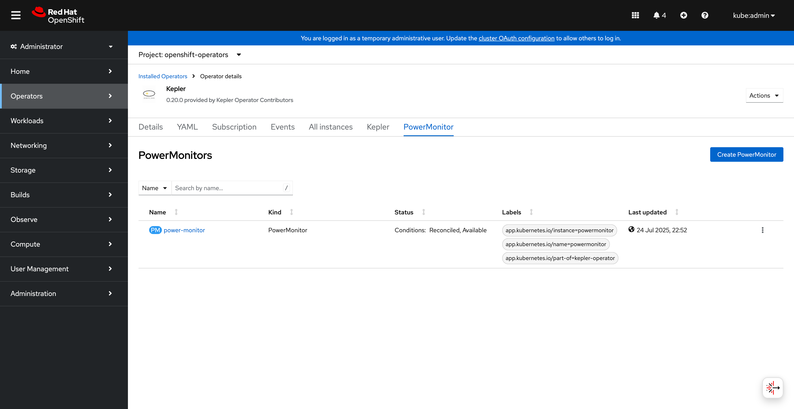

# Kepler Operator on OpenShift

## Overview

PowerMonitor is the modern Kepler Custom Resource Definition that provides enhanced
configuration options and improved resource management for Kepler deployments. This
guide demonstrates how to install and configure the Kepler operator with PowerMonitor
on OpenShift using both the web console and command-line interfaces.

## Migration Notice

!!! warning "Important"
    The Kepler CRD is deprecated and will be removed in a future release. Please
    use PowerMonitor instead for all new deployments and migrate existing
    installations to ensure continued support.

## Requirements

Before you start make sure you have:

- OpenShift cluster access with `cluster-admin` privileges
- User Workload Monitoring enabled in your cluster
- Access to OperatorHub (for UI installation)
- `oc` CLI tool installed (for command-line operations)

!!! note
    Your operator will automatically use the current context in your kubeconfig
    file (i.e. whatever cluster `oc cluster-info` shows).

## Installation Methods

### Method 1: OperatorHub Installation (Recommended)

#### Step 1: Access OperatorHub

Navigate to **Operators** → **OperatorHub** in the OpenShift web console and
search for "kepler":



Kepler operator available in OperatorHub

#### Step 2: Install the Operator

Click **Install** to begin the installation process:


Starting the Kepler operator installation

Monitor the installation progress:


Operator installation in progress

#### Step 3: Verify Installation

Once the installation completes successfully:


Operator successfully installed and ready for use

#### Step 4: Explore Operator Details

Navigate to the operator details to see available APIs:


Kepler operator details showing PowerMonitor and deprecated Kepler APIs

Click on the **PowerMonitor** tab to access the modern API:



PowerMonitor API tab in operator details

### Method 2: Command Line Installation

If you prefer using the command line, you can install the operator directly:

```bash
# Create the operator subscription
oc apply -f - << EOF
apiVersion: operators.coreos.com/v1alpha1
kind: Subscription
metadata:
  name: kepler-operator
  namespace: openshift-operators
spec:
  channel: alpha
  name: kepler-operator
  source: community-operators
  sourceNamespace: openshift-marketplace
EOF
```

Wait for the operator to be ready:

```bash
oc get csv -n openshift-operators | grep kepler
```

## PowerMonitor Configuration

### Step 1: Create PowerMonitor Instance

You can create a PowerMonitor instance using the web console or command line.

#### Using Web Console

Click **Create PowerMonitor** in the operator details:


PowerMonitor YAML configuration in OpenShift editor

#### Using Command Line

Create a basic PowerMonitor configuration:

```yaml
apiVersion: kepler.system.sustainable.computing.io/v1alpha1
kind: PowerMonitor
metadata:
  name: power-monitor
  labels:
    app.kubernetes.io/name: powermonitor
    app.kubernetes.io/instance: powermonitor
    app.kubernetes.io/part-of: kepler-operator
spec:
  kepler:
    config:
      logLevel: info
      metricLevels:
      - node
      - pod
      - vm
      sampleRate: 5s
      staleness: 500ms
      maxTerminated: 500
    deployment:
      security:
        mode: none
```

Apply the configuration:

```bash
oc apply -f power-monitor.yaml
```

### Step 2: Verify PowerMonitor Deployment

Check the PowerMonitor instance status:


PowerMonitor instance details and status conditions

Verify the DaemonSet is running:

```bash
oc get powermonitor power-monitor -o wide
oc get daemonset -n power-monitor
```

## Configuration Options

### Basic Configuration

The PowerMonitor CRD provides several configuration options:

#### Metric Levels

Control which metrics are exported:

```yaml
spec:
  kepler:
    config:
      metricLevels:
      - node      # Node-level power consumption
      - pod       # Pod-level power consumption
      - vm        # Virtual machine power consumption
      - process   # Process-level power consumption
      - container # Container-level power consumption
```

#### Timing Settings

Configure sample rates and staleness thresholds:

```yaml
spec:
  kepler:
    config:
      sampleRate: 5s      # How often to sample metrics
      staleness: 500ms    # How long before values are considered stale
```

#### Security Configuration

Configure security mode and service accounts:

```yaml
spec:
  kepler:
    deployment:
      security:
        mode: rbac  # Options: none, rbac
        allowedSANames:
        - "my-service-account"
```

#### Resource Management

Control terminated workload tracking:

```yaml
spec:
  kepler:
    config:
      maxTerminated: 500  # Track top 500 terminated workloads
      # maxTerminated: 0   # Disable terminated workload tracking
      # maxTerminated: -1  # Track unlimited terminated workloads
```

#### Additional Configuration

Use additional ConfigMaps for extended configuration:

```yaml
spec:
  kepler:
    config:
      additionalConfigMaps:
      - name: my-custom-config
      - name: extended-settings
```

### Advanced Configuration

#### Node Selection and Tolerations

Control where Kepler pods are scheduled:

```yaml
spec:
  kepler:
    deployment:
      nodeSelector:
        kubernetes.io/os: linux
        node-type: worker
      tolerations:
      - key: node-role.kubernetes.io/master
        operator: Exists
        effect: NoSchedule
```

## Monitoring and Grafana Setup

### Enable User Workload Monitoring

Ensure User Workload Monitoring is enabled in your cluster:

```bash
oc -n openshift-monitoring get configmap cluster-monitoring-config -o yaml
```

If not enabled, create the configuration:

```yaml
apiVersion: v1
kind: ConfigMap
metadata:
  name: cluster-monitoring-config
  namespace: openshift-monitoring
data:
  config.yaml: |
    enableUserWorkload: true
```

### Access OpenShift Metrics

Navigate to **Observe** → **Metrics** in the OpenShift console:


OpenShift metrics dashboard showing power consumption overview

View detailed power consumption metrics:


Detailed OpenShift metrics dashboard with power consumption charts and node information

### Service Monitor Configuration

The operator automatically creates ServiceMonitor resources, but you can verify:

```bash
oc get servicemonitor -n power-monitor
```

### Grafana Dashboard

For advanced visualization, you can import the Kepler Grafana dashboard:

```bash
# Get the dashboard JSON
curl -O https://raw.githubusercontent.com/sustainable-computing-io/kepler-operator/main/hack/dashboard/assets/kepler/dashboard.json

# Import into your Grafana instance
```

## Management and Troubleshooting

### Checking PowerMonitor Status

Monitor the PowerMonitor resource status:

```bash
# Check PowerMonitor status
oc get powermonitor power-monitor -o yaml

# Check conditions
oc describe powermonitor power-monitor
```

### DaemonSet Verification

Verify the Kepler DaemonSet is running properly:

```bash
# Check DaemonSet status
oc get daemonset -n power-monitor

# Check pod status on each node
oc get pods -n power-monitor -o wide

# Check logs
oc logs -n power-monitor -l app.kubernetes.io/name=kepler-exporter
```

### Common Issues and Solutions

#### Issue: PowerMonitor not creating DaemonSet

**Solution**: Check operator logs and resource permissions:

```bash
# Check operator logs
oc logs -n openshift-operators deployment/kepler-operator-controller-manager

# Verify RBAC permissions
oc auth can-i create daemonsets --as=system:serviceaccount:openshift-operators:kepler-operator-controller-manager
```

#### Issue: Pods not scheduling on nodes

**Solution**: Check node selectors and tolerations:

```bash
# Check node labels
oc get nodes --show-labels

# Update nodeSelector in PowerMonitor spec if needed
oc patch powermonitor power-monitor --type='merge' -p='{"spec":{"kepler":{"deployment":{"nodeSelector":{"kubernetes.io/os":"linux"}}}}}'
```

#### Issue: Missing metrics in monitoring

**Solution**: Verify ServiceMonitor and endpoint configuration:

```bash
# Check ServiceMonitor
oc get servicemonitor -n power-monitor -o yaml

# Check service endpoints
oc get endpoints -n power-monitor

# Test metrics endpoint
oc port-forward -n power-monitor svc/kepler-exporter 9102:9102
curl http://localhost:9102/metrics
```

## Migration from Kepler CRD

If you have existing Kepler CRD instances, migrate to PowerMonitor:

### Step 1: Export Current Configuration

```bash
oc get kepler kepler -o yaml > kepler-backup.yaml
```

### Step 2: Create Equivalent PowerMonitor

Convert the configuration structure:

```yaml
# Old Kepler CRD (deprecated)
apiVersion: kepler.system.sustainable.computing.io/v1alpha1
kind: Kepler
spec:
  exporter:
    deployment:
      port: 9102

# New PowerMonitor CRD
apiVersion: kepler.system.sustainable.computing.io/v1alpha1
kind: PowerMonitor
spec:
  kepler:
    config:
      logLevel: info
    deployment:
      security:
        mode: none
```

### Step 3: Apply and Verify

```bash
oc apply -f power-monitor.yaml
oc delete kepler kepler  # Remove old resource after verification
```

## Uninstall

To remove the PowerMonitor and operator:

```bash
# Delete PowerMonitor instance
oc delete powermonitor power-monitor

# Uninstall operator (if desired)
oc delete subscription kepler-operator -n openshift-operators
oc delete csv -n openshift-operators $(oc get csv -n openshift-operators -o name | grep kepler)
```

## Next Steps

- [View project resources](../../project/resources.md) for additional documentation
- [Get support](../../project/support.md) for help and contributions
