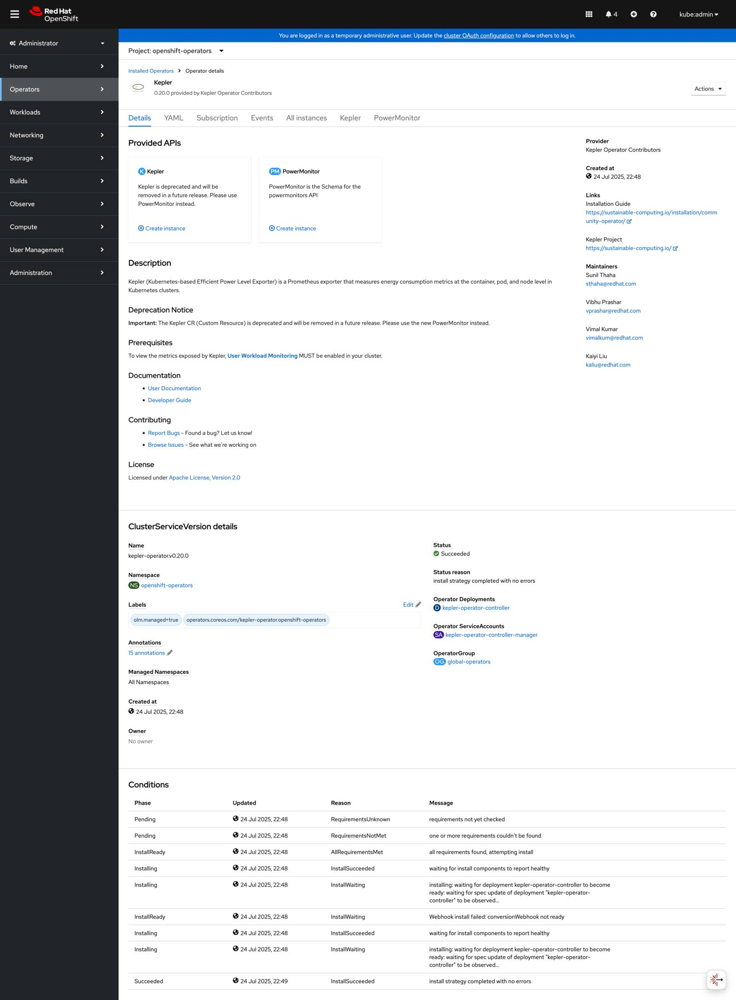

# Quick Start Guide: OpenShift OperatorHub

This guide walks you through installing the Kepler Operator using the OpenShift web
console and creating your first PowerMonitor instance.

## Step 1: Install the Operator

### Access OperatorHub

Navigate to **Operators** → **OperatorHub** in the OpenShift web console and
search for "kepler":


*Kepler operator available in OperatorHub*

### Start Installation

Click **Install** to begin the installation process:


*Starting the Kepler operator installation*

### Monitor Progress

Watch the installation progress in the console:


*Operator installation in progress*

### Verify Installation

Once the installation completes successfully:


*Operator successfully installed and ready for use*

## Step 2: Create PowerMonitor Instance

### Access Operator Details

Navigate to the operator details to see available APIs:


*Kepler operator details showing PowerMonitor and deprecated Kepler APIs*

### Open PowerMonitor Tab

Click on the **PowerMonitor** tab to access the modern API:


*PowerMonitor API tab in operator details*

### Create PowerMonitor

Click **Create PowerMonitor** to open the YAML editor:


*PowerMonitor YAML configuration in OpenShift editor*

Use this basic configuration:

```yaml
apiVersion: kepler.system.sustainable.computing.io/v1alpha1
kind: PowerMonitor
metadata:
  name: power-monitor
  labels:
    app.kubernetes.io/name: powermonitor
    app.kubernetes.io/instance: powermonitor
    app.kubernetes.io/part-of: kepler-operator
spec:
  kepler:
    config:
      logLevel: info
      metricLevels:
      - node
      - pod
      - vm
      sampleRate: 5s
      staleness: 500ms
      maxTerminated: 500
    deployment:
      security:
        mode: none
```

## Step 3: Verify Deployment

### Check PowerMonitor Status

View the PowerMonitor instance details and status:


*PowerMonitor instance details and status conditions*

### Verify DaemonSet

Check that the DaemonSet is running on your nodes:

```bash
oc get powermonitor power-monitor -o wide
oc get daemonset -n power-monitor
oc get pods -n power-monitor -o wide
```

## Step 4: Access Metrics

### OpenShift Metrics Console

Navigate to **Observe** → **Metrics** in the OpenShift console:


*OpenShift metrics dashboard showing power consumption overview*

### View Power Metrics

Explore detailed power consumption metrics:


*Detailed OpenShift metrics dashboard with power consumption charts and node information*

## Next Steps

Now that you have Kepler running, explore these guides:

- **[Configuration Guide](../configuration/index.md)** - Customize your deployment
- **[Monitoring Setup](../configuration/monitoring-troubleshooting.md)** - Advanced monitoring and Grafana
- **[Troubleshooting](../configuration/monitoring-troubleshooting.md#troubleshooting)** - Common issues and solutions

## Quick Reference

### Common Commands

```bash
# Check PowerMonitor status
oc get powermonitor power-monitor

# View operator logs
oc logs -n openshift-operators deployment/kepler-operator-controller-manager

# Check Kepler pod logs
oc logs -n power-monitor -l app.kubernetes.io/name=kepler-exporter

# Test metrics endpoint
oc port-forward -n power-monitor svc/kepler-exporter 9102:9102
curl http://localhost:9102/metrics
```
