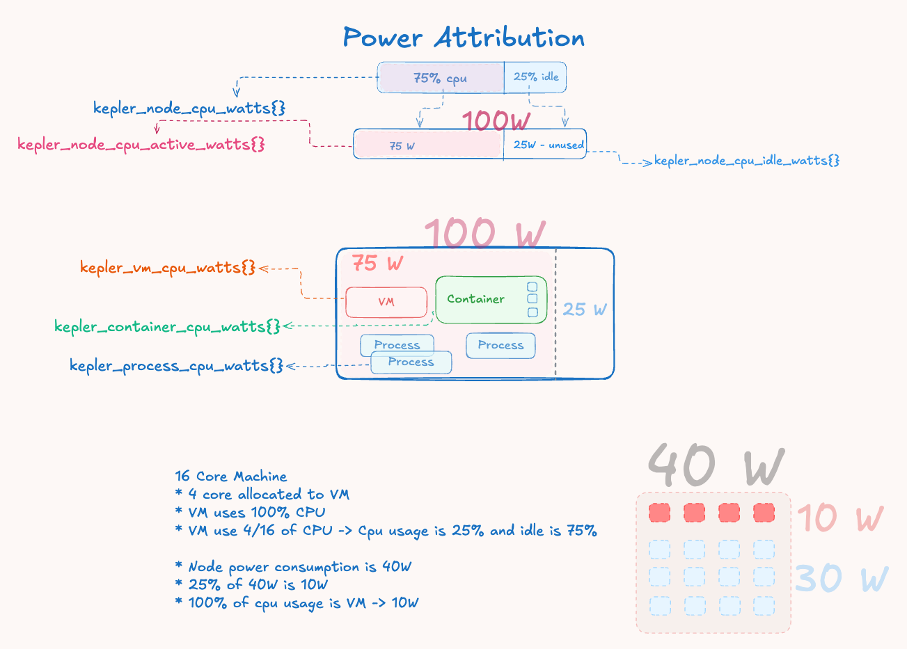

# Understanding Kepler Power Attribution

This guide explains how Kepler measures and attributes power consumption to
processes, containers, VMs, and pods running on your system.

## How Power Attribution Works

### The Big Picture

Modern systems lack per-workload energy metering, providing only aggregate
power consumption at the hardware level. Kepler addresses this attribution
challenge through proportional distribution based on resource utilization:

1. **Hardware Energy Collection** - Intel RAPL sensors provide cumulative
   energy counters at package, core, DRAM, and uncore levels
2. **System Activity Analysis** - CPU utilization metrics from `/proc/stat`
   determine the ratio of active vs idle system operation
3. **Power Domain Separation** - Total energy is split into active power
   (proportional to workload activity) and idle power (baseline consumption)
4. **Proportional Attribution** - Active power is distributed to workloads
   based on their CPU time consumption ratios

### Core Philosophy

Kepler implements a **CPU-time-proportional energy attribution model** that
distributes hardware-measured energy consumption to individual workloads based
on their computational resource usage patterns.

The fundamental principle recognizes that system power consumption has two
distinct components:

- **Active Power**: Energy consumed by computational work, proportional to CPU
  utilization and scalable with workload activity
- **Idle Power**: Fixed baseline energy for maintaining system operation,
  including memory refresh, clock distribution, and idle core power states

### Attribution Formula

All workload types use the same proportional attribution formula:

```text
Workload Power = (Workload CPU Time Δ / Node CPU Time Δ) × Active Power
```

This ensures energy conservation - the sum of attributed power remains
proportional to measured hardware consumption while maintaining fairness based
on actual resource utilization.



*Figure 1: Power attribution flow showing how total measured power is
decomposed into active and idle components, with active power distributed
proportionally based on workload CPU time deltas.*

## Understanding Energy vs Power

- **Energy**: Measured in microjoules (μJ) as cumulative counters from hardware
- **Power**: Calculated as rate in microwatts (μW) using `Power = ΔEnergy / Δtime`

## Energy Zones

Kepler reads CPU energy from Intel RAPL via the sysfs powercap interface
(`/sys/class/powercap/intel-rapl:*`). Zones are **discovered dynamically at
runtime** rather than assumed from a hardcoded list, so Kepler adapts to the
zones each host actually exposes. Commonly available zones include:

- **Package**: CPU package-level energy consumption
- **Core**: Individual CPU core energy
- **DRAM**: Memory subsystem energy
- **Uncore**: Integrated graphics and other uncore components
- **PSys**: Platform-level energy (most comprehensive when available)

When multiple zones are present, Kepler selects a primary zone by coverage
priority (for example, PSys or Package) as the basis for node power, and can
filter zones by name via configuration.

## Platform Power Sources

Beyond Intel RAPL, Kepler can read node/platform power from additional
hardware interfaces when available:

- **RAPL (sysfs powercap)**: default CPU package/DRAM energy source on Intel
  and compatible platforms.
- **HWMon (sysfs)**: reads power/energy sensors exposed under the Linux hwmon
  subsystem, useful where RAPL is unavailable or incomplete.
- **Redfish BMC**: queries the platform's Baseboard Management Controller over
  Redfish for chassis-level power, using the `PowerSubsystem` API with a
  fallback to the deprecated `Power` API on older BMCs. This provides
  whole-node power independent of the CPU energy counters.

## GPU Power Attribution

On NVIDIA GPUs, Kepler attributes GPU power to workloads using NVML rather than
RAPL:

1. **Device power** is read directly from NVML
   (`nvmlDeviceGetPowerUsage`, instantaneous watts — no delta calculation is
   needed, unlike RAPL energy counters).
2. **Idle vs active split**: Kepler tracks a per-device idle baseline (the
   minimum power observed while no compute processes are running) and treats
   power above that baseline as active power.
3. **Per-process attribution**: active power is distributed across processes in
   proportion to their SM (streaming multiprocessor) utilization, obtained via
   `nvmlDeviceGetProcessUtilization`.
4. **MIG (Multi-Instance GPU)**: for partitioned GPUs, per-instance activity is
   obtained from DCGM (NVML reports N/A for MIG power) and used to split power
   across instances; when DCGM is unavailable, power is distributed equally
   among the running processes as a fallback.

GPU power is exported through dedicated metrics such as `kepler_node_gpu_watts`
and `kepler_process_gpu_watts`.

## Attribution Examples

### Example 1: Basic Power Split

**System State:**

- Hardware reports: 40W total system power
- Node CPU usage: 25% utilization ratio
- Power split: 40W × 25% = 10W active, 30W idle

**Workload Attribution:**
If a container used 20% of total node CPU time during the measurement
interval:

- **Container power** = (20% CPU usage) × 10W active = 2W

### Example 2: Multi-Workload Scenario

**System State:**

- Total power: 60W
- CPU usage ratio: 33.3% (1/3)
- Active power: 20W, Idle power: 40W
- Node total CPU time: 1000ms

**Process-Level CPU Usage:**

- Process 1 (standalone): 100ms CPU time
- Process 2 (in container-A): 80ms CPU time
- Process 3 (in container-A): 70ms CPU time
- Process 4 (in container-B): 60ms CPU time
- Process 5 (QEMU hypervisor): 200ms CPU time
- Process 6 (in container-C, pod-X): 90ms CPU time
- Process 7 (in container-D, pod-X): 110ms CPU time

**Hierarchical CPU Time Aggregation:**

- Container-A CPU time: 80ms + 70ms = 150ms
- Container-B CPU time: 60ms
- Container-C CPU time: 90ms (part of pod-X)
- Container-D CPU time: 110ms (part of pod-X)
- Pod-X CPU time: 90ms + 110ms = 200ms
- VM CPU time: 200ms (QEMU hypervisor process)

**Independent Power Attribution (each from node active power):**

- Process 1: (100ms / 1000ms) × 20W = 2W
- Container-A: (150ms / 1000ms) × 20W = 3W
- Container-B: (60ms / 1000ms) × 20W = 1.2W
- Pod-X: (200ms / 1000ms) × 20W = 4W
- VM: (200ms / 1000ms) × 20W = 4W

**Note:** Each workload type calculates power independently from node active
power based on its own CPU time, not by inheriting from constituent workloads.

### Example 3: Container with Multiple Processes

**Container "web-server":**

- Process 1 (nginx): 100ms CPU time
- Process 2 (worker): 50ms CPU time
- Container total: 150ms CPU time

**If node total CPU time is 1000ms:**

- Container CPU ratio: 150ms / 1000ms = 15%
- Container power: 15% × active power

### Example 4: Pod with Multiple Containers

**Pod "frontend":**

- Container 1 (nginx): 200ms CPU time
- Container 2 (sidecar): 50ms CPU time
- Pod total: 250ms CPU time

**If node total CPU time is 1000ms:**

- Pod CPU ratio: 250ms / 1000ms = 25%
- Pod power: 25% × active power

## Limitations and Considerations

### When CPU Attribution Works Well

- **CPU-bound workloads** with similar instruction mixes
- **Steady-state workloads** without significant frequency scaling
- **Relative comparisons** between similar workload types
- **Trend analysis** over longer time periods

### When to Exercise Caution

- **Mixed workload environments** with varying compute vs I/O patterns
- **High-performance computing** workloads using specialized instructions
- **Absolute power budgeting** decisions based solely on Kepler metrics
- **Fine-grained optimization** requiring precise per-process power measurement

### Workload-Specific Characteristics

#### Compute vs Memory-Bound Workloads

```text
Example Scenario:
- Process A: 50% CPU, compute-intensive (high frequency, active execution)
- Process B: 50% CPU, memory-bound (frequent stalls, lower frequency)

Current Attribution: Both receive equal power
Reality: Process A likely consumes 2-3x more power
```

#### CPU Power States Impact

Modern CPUs implement sophisticated power management that affects attribution
accuracy:

- **C-States (CPU Sleep States)**: Different sleep behaviors affect power consumption
- **P-States (Performance States)**: Dynamic frequency scaling affects power per CPU cycle
- **Instruction-Level Variations**: Vector instructions consume more power than scalar operations

### Beyond CPU Attribution

#### Memory and I/O Considerations

- **DRAM Power**: Memory-intensive workloads consume more DRAM power
- **Storage I/O**: Triggers storage controller and device power
- **Network I/O**: Consumes network interface and PCIe power
- **GPU Workloads**: integrated-graphics power is not captured by CPU metrics.
  Discrete NVIDIA GPU power is captured separately via NVML (see
  [GPU Power Attribution](#gpu-power-attribution)).

## Key Metrics

- `kepler_node_cpu_watts{}`: Total node power consumption
- `kepler_process_cpu_watts{}`: Individual process power
- `kepler_container_cpu_watts{}`: Container-level power
- `kepler_vm_cpu_watts{}`: Virtual machine power
- `kepler_pod_cpu_watts{}`: Kubernetes pod power
- `kepler_node_gpu_watts{}`: Total GPU power (NVIDIA/NVML)
- `kepler_process_gpu_watts{}`: Per-process GPU power attribution

## A Note on the Trained Model Server

Earlier Kepler versions could estimate power using a trained ML model served by
the `kepler-model-server`. The v0.10+ re-architecture reads power directly from
hardware interfaces (RAPL, HWMon, Redfish, NVML) and the trained model-server
does **not** yet integrate with the rewrite. Power figures in this guide come
from these hardware sources, not from a trained estimator.

## Conclusion

Kepler's power attribution system provides practical, proportional distribution
of hardware energy consumption to individual workloads. While CPU-time-based
attribution has inherent limitations due to modern CPU complexity, it offers a
good balance between accuracy, simplicity, and performance overhead for most
monitoring and optimization use cases.

Understanding both the capabilities and limitations helps users make informed
decisions about when and how to rely on Kepler's power attribution metrics.
