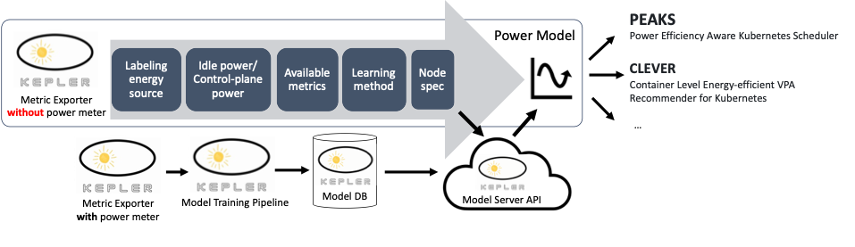

# Training Pipeline

As shown in the below figure, a power model can be attributed by the path it was trained. Training pipeline is an abstract of power model training that applies a set of learning methods to a different combination of energy source labels, available metrics, and idle/control plane power isolation choices to each specific group of nodes/machines. 

A training pipeline starts from reading the Kepler-exporting metrics from Prometheus query (prom) and finally submits an archived models to the model database (model DB). 

From Kepler queries, the default extractor generates a dataframe with the following columns.

timestamp|features|labels[unit]\_[#unit]\_[component]\_power|node type
---|---|---|---
timestamp|e.g., cgroupfs_cpu_usage_us cgroupfs_memory_usage_bytes cgroupfs_system_cpu_usage_us cgroupfs_user_cpu_usage_us|e.g., package_0_package_power package_1_package_power package_0_core_power package_1_core_power package_0_uncore_power package_1_uncore_power package_0_dram_power package_1_dram_power|node_type

<!-- TOC tocDepth:2..3 chapterDepth:2..6 -->

- [Labeling energy source](#labeling-energy-source)
- [Idle power/Control plane power](#idle-powercontrol-plane-power)
- [Available metrics](#available-metrics)
- [Learning methods](#learning-methods)
- [Node Spec](#node-spec)

<!-- /TOC -->

## Labeling energy source

`energy source` or `source` refers to the source (power meter) that provides an energy number. Each source provides one or more `energy components`. Currently supported source are shown as below.

Energy/power source|Energy/power components
---|---
[rapl](../design/kepler-energy-sources.md#rapl---running-average-power-limit)|package, core, uncore, dram
[acpi](../design/kepler-energy-sources.md#using-kernel-driver-xgene-hwmon)|platform
||

## Idle power/Control plane power

`isolate` is a mechanism to separate the power portion that is consumed on the node in an idle state or the power portion that is consumed by operating systems and control plane processes. These portions of power is more than zero even if the metric utilization of workload is zero. We called the models those are trained after isolating these power portions as `DynPower` models. At the same time, the models those are trained without isolation are called `AbsPower` models. `DynPower` model is used to estimate `container power` and `process power` while `AbsPower` model is used to estimate `node power`.

There are two common available `isolators`: *ProfileIsolator* and *MinIdleIsolator*. 

*ProfileIsolator* relies on profiled background powers (profiles) and removes resource usages by system processes from the training while *MinIdleIsolator* assumes minimum power as an idle power and includes resource usages by system processes in the training. 

The pipeline with *ProfileIsolator* will be applied first if the profile that matches the training `node_type` is available. Otherwise, the other pipeline will be applied. 

(check how profiles are generated [here](./node_profile.md))

## Available metrics

`feature group` is an abstract that groups available features based on origin of the resource utilization metrics. On some node environments, some origin can be inaccessible such as hardware counter on the virtual private cloud. The model are trained for each defined group as below.

Group Name|Features|Kepler Metric Source(s)
---|---|---
CounterOnly|COUNTER_FEATURES|[Hardware Counter](../design/metrics.md#hardware-counter-metrics)
CgroupOnly|CGROUP_FEATURES|[cGroups](../design/metrics.md#cgroups-metrics)
BPFOnly|BPF_FEATURES|[BPF](../design/metrics.md#base-metric)
KubeletOnly|KUBELET_FEATURES|[Kubelet](../design/metrics.md#kubelet-metrics)
IRQOnly|IRQ_FEATURES|[IRQ](../design/metrics.md#irq-metrics)
CounterIRQCombined|COUNTER_FEATURES, IRQ_FEATURES|BPF and Hardware Counter
Basic|COUNTER_FEATURES, CGROUP_FEATURES, BPF_FEATURES, KUBELET_FEATURES|All except IRQ and node information
WorkloadOnly|COUNTER_FEATURES, CGROUP_FEATURES, BPF_FEATURES, IRQ_FEATURES, KUBELET_FEATURES|All except node information
Full|WORKLOAD_FEATURES, SYSTEM_FEATURES|All
||

> node information refers to value from [kepler_node_info](../design/metrics.md#kepler-metrics-for-node-information) metric.

## Learning methods

`trainer` is an abstract to define the learning method applies to each feature group with each given power labeling source. `Trainer` class has 9 abstract methods.

1. load previous checkpoint model via implemented `(i) load_local_checkpoint` or `(ii) load_remote_checkpoint`. If the checkpoint cannot be loaded, initialize the model by calling implemented `(iii) init_model`.

2. load and apply scaler to input data

3. call implemented `(iv) train` and save the checkpoint via `(v) save_checkpoint`

4. check whether to archive the model and push to database via `(vi) should_archive`. If yes, 
      
      4.1.  get trainer-specific basic metadata via `(vii) get_basic_metadata`

      4.2. fill with required metadata, save it as metadata file (metadata.json)

      4.3. call `(viii) save_model`

      4.4. If `(iv) get_weight_dict` function is implemented (only for linear regression based trainer), the weight dict will be saved in the file named `weight.json`.

      4.5. archive the model folder. The model name will be in the format `<trainer class>_<node_type>`.

      4.6. push the archived model and `weight.json` (if available) to the database

If the trainer is based on scikit-learn, consider implementing only `init_model` method of `ScikitTrainer`.

The intermediate checkpoint and output of model will be saved locally in folder `MODEL_PATH/<PowerSource>/<ModelOutputType>/<FeatureGroup>`. The default `MODEL_PATH` is `src/models`.

## Node Spec

Kepler forms multiple groups of machines (nodes) based on its benchmark performance and trains a model separately for each group. The identified group is exported as `node type`. 