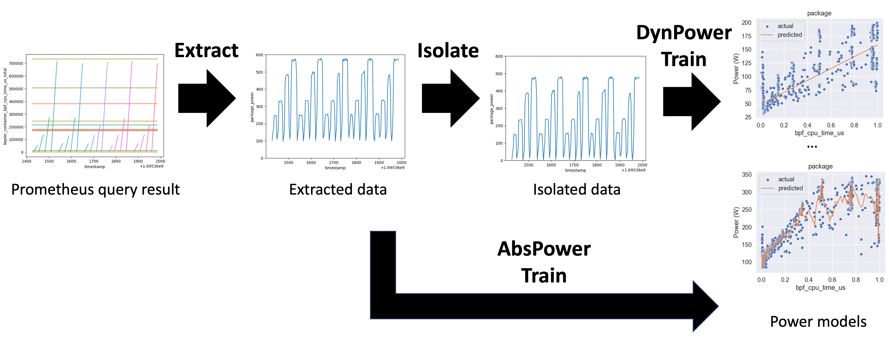

# Training Pipeline

Model server can provide various power models for different context and learning methods. Training pipeline is an abstract of power model training that applies a set of learning methods to a different combination of energy sources, power isolation methods, available energy-related metrics.  

## Pipeline
`pipeline` is composed of three steps, `extract`, `isolate`, and `train`, as shown below. Kepler exports energy-related metrics as Prometheus counter, which provides accumulated number over time. The `extract` step is to convert the counter metrics to gauge metrics, similarly to the Prometheus `rate()` function, giving per-second values. The extract step also clean up the data separately for each `feature group`. The power consumption retrieved from the Prometheus query is the measured power which is composed of the power portion which is varied by the workload called dynamic power and the power portion which is consumed even if in the idling state called idle power. The `isolate` step is to calculate the idle power and isolate the dynamic power consumption of each `energy source`. The `train` step is to apply each `trainer` to create multiple choices of power models based on the preprocessed data. 

> We have a roadmap to apply a pipeline to build power models separately for each node/machine type. Find more in [Node Type](#node-type) section.

- Learn more about `energy source` from [Energy source](#energy-source) section.
- Learn more about `feature group` from [Feature groups](#feature-groups) section.
- Learn more about the `isolate` step and corresponding concepts of `AbsPower`, and `DynPower` power models from [Power isolation](#power-isolation) section.
- Check available `trainer` in [Trainer](#learning-methods) section.

## Energy source

`energy source` or `source` refers to the source (power meter) that provides an energy number. Each source provides one or more `energy components`. Currently supported source are shown as below.

Energy/power source|Energy/power components
---|---
[rapl](../design/kepler-energy-sources.md#rapl---running-average-power-limit)|package, core, uncore, dram
[acpi](../design/kepler-energy-sources.md#using-kernel-driver-xgene-hwmon)|platform
||

## Feature group

`feature group` is an abstraction of the available features based on the infrastructure context since some environments might not expose some metrics. For example, on the virtual machine in private cloud environment, hardware counter metrics are typically not available. Therefore, the models are trained for each defined resource utilization metric group as below.

Group Name|Features|Kepler Metric Source(s)
---|---|---
CounterOnly|COUNTER_FEATURES|[Hardware Counter](../design/metrics.md#hardware-counter-metrics)
CgroupOnly|CGROUP_FEATURES|[cGroups](../design/metrics.md#cgroups-metrics)
BPFOnly|BPF_FEATURES|[BPF](../design/metrics.md#base-metric)
IRQOnly|IRQ_FEATURES|[IRQ](../design/metrics.md#irq-metrics)
AcceleratorOnly|ACCELERATOR_FEATURES|[Accelerator](../design/metrics.md#Accelerator-metrics)
CounterIRQCombined|COUNTER_FEATURES, IRQ_FEATURES|BPF and Hardware Counter
Basic|COUNTER_FEATURES, CGROUP_FEATURES, BPF_FEATURES, KUBELET_FEATURES|All except IRQ and node information
WorkloadOnly|COUNTER_FEATURES, CGROUP_FEATURES, BPF_FEATURES, IRQ_FEATURES, KUBELET_FEATURES, ACCELERATOR_FEATURES|All except node information
Full|WORKLOAD_FEATURES, SYSTEM_FEATURES|All
||

Node information refers to value from [kepler_node_info](../design/metrics.md#kepler-metrics-for-node-information) metric.

## Power isolation

The power consumption retrieved from the Prometheus query is the absolute power, which is the sum of idle and dynamic power (where idle represents the system at rest, dynamic is the incremental power with resource utilization, and absolute is idle + dynamic). Additionally, this power is also the total power consumption of all process, including the users' workload, background and OS processes. The `isolate` step applies a mechanism to separate idle power from absolute power, resulting in dynamic power  It also covers an implementation to separate the dynamic power consumed by background and OS processes (referred to as `system_processes`). It's important to note that both the idle and dynamic `system_processes` power are higher than zero, even when the metric utilization of the users' workload is zero. 

> We have a roadmap to identify and isolate a constant power portion which is significantly increased at a specific resource utilization called `activation power` to fully isolate all constant power consumption from the dynamic power.

We refer to models trained using the isolate step as `DynPower` models. Meanwhile, models trained without the isolate step are called `AbsPower` models. Currently, the `DynPower` model does not include idle power information, but we plan to incorporate it in the future.

There are two common available `isolators`: *ProfileIsolator* and *MinIdleIsolator*. 

*ProfileIsolator* relies on collecting data (e.g., power and resource utilization) for a specific period without running any user workload (referred to as profile data). This isolation mechanism also eliminates the resource utilization of `system_processes` from the data used to train the model.

On the other hand, *MinIdleIsolator* identifies the minimum power consumption among all samples in the training data, assuming that this minimum power consumption represents both the idle power and `system_processes` power consumption. While we should also remove the minimal resource utilization from the data used to train the model, this isolation mechanism includes the resource utilization by `system_processes` in the training data. However, we plan to remove it in the future.

If the `profile data` that matches a given `node_type` exist, the pipeline will use the *ProfileIsolator* to preprocess the training data. Otherwise, the the pipeline will applied another isolation mechanism, such as the *MinIdleIsolator*.

(check how profiles are generated [here](./node_profile.md))

> The choice between using the `DynPower` or `AbsPower` model is still under investigation. In some cases, DynPower exhibits better accuracy than `AbsPower`. However, we currently utilize the `AbsPower` model to estimate node power for Platform, CPU and DRAM components, as the `DynPower` model lacks idle power information.

> It's worth mentioning that exposing idle power on a VM in a public cloud environment is not possible. This is because the host's idle power must be distributed among all running VMs on the host, and it's impossible to determine the number of VMs running on the host in a public cloud environment. Therefore, we can only expose idle power if there is only one VM running on the node (for a very specific scenario), or if the power model is being used in Bare Metal environments.

## Trainer

`trainer` is an abstraction to define the learning method applies to each feature group with each given power labeling source. 

Available trainer (v0.6):

- PolynomialRegressionTrainer
- GradientBoostingRegressorTrainer
- SGDRegressorTrainer
- KNeighborsRegressorTrainer
- LinearRegressionTrainer
- SVRRegressorTrainer

## Node type

Kepler forms multiple groups of machines (nodes) based on its benchmark performance and trains a model separately for each group. The identified group is exported as `node type`. 
