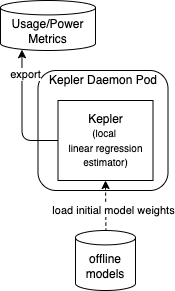
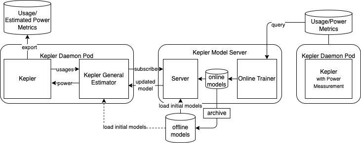

# Kepler Power Estimation Deployment

In Kepler, we also provide a power estimation solution from the resource usages in the system that there is no power measuring tool installed or supported.
There are two alternatives of estimators.

## Estimators

- **Local Linear Regression Estimator**: This estimator estimates power using the trained weights multiplied by normalized value of usage metrics (Linear Regression Model).

- **General Estimator Sidecar**: This estimator transforms the usage metrics and applies with the trained models which can be any regression models from scikit-learn library or any neuron networks from Keras (TensorFlow). To use this estimator, the Kepler estimator needs to be enabled.

On top of that, the trained models as well as weights can be updated periodically with online training routine by connecting the Kepler model server API.

## Deployment Scenarios

### Minimum Deployment

The minimum deployment is to use local linear regression estimator in Kepler main container with only offline-trained model weights.

### Deployment with General Estimator Sidecar

To enable general estimator for power inference, the estimator sidecar can be deployed as shown in the following figure.
The connection between two containers is a unix domain socket which is lightweight and fast.
Unlike the local estimator, the general estimator sidecar is instrumented with several inference-supportive libraries and dependencies.
This additional overhead must be tradeoff to an increasing estimation accuracy expected from flexible choices of models.

### Minimum deployment connecting to Kepler Model Server

To get the updated weights which is expected to provide better estimation accuracy, Kepler may connect to remote Kepler Model Server that performs online training using data from the system with the power measuring tool as below.

### Full deployment

The following figure shows the deployment that Kepler General Estimator is enabled and it is also connecting to remote Kepler Model Server.
The Kepler General Estimator sidecar can update the model from the Kepler Model Server on the fly and expect the most accurate model.

## Provided power models on Kepler Model DB

version|power data source|pipeline|available energy sources|error report
---|---|---|---|---
[0.6](https://github.com/sustainable-computing-io/kepler-model-db/tree/main/models/v0.6)|[nx12](https://github.com/sustainable-computing-io/kepler-model-db/tree/main/models/v0.6/nx12)|[std_v0.6](https://github.com/sustainable-computing-io/kepler-model-db/blob/main/models/v0.6/.doc/std_v0.6.md)|rapl,acpi|[Link](https://github.com/sustainable-computing-io/kepler-model-db/blob/main/models/v0.6/nx12/README.md)
[0.7](https://github.com/sustainable-computing-io/kepler-model-db/tree/main/models/v0.7)|[SPECpower](https://www.spec.org/power_ssj2008/)|[specpower](https://github.com/sustainable-computing-io/kepler-model-db/blob/main/models/v0.7/.doc/specpower.md)|acpi|[Link](https://github.com/sustainable-computing-io/kepler-model-db/tree/main/models/v0.7/specpower)
[0.7](https://github.com/sustainable-computing-io/kepler-model-db/tree/main/models/v0.7)|[Training Playbook](https://github.com/sustainable-computing-io/kepler-model-training-playbook)|[ec2](https://github.com/sustainable-computing-io/kepler-model-db/blob/main/models/v0.7/.doc/ec2.md)|intel_rapl|[Link](https://github.com/sustainable-computing-io/kepler-model-db/tree/main/models/v0.7/ec2)
