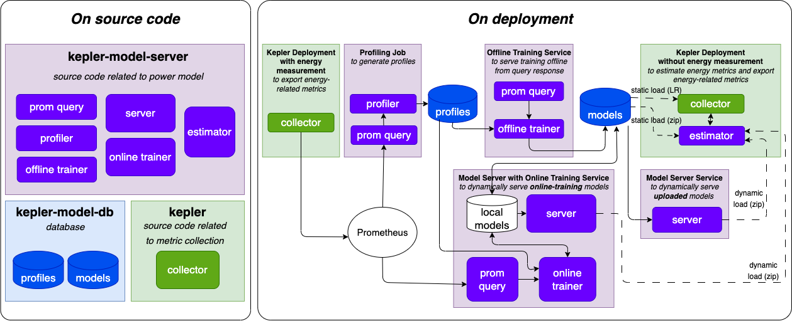

# Kepler Model Server
Kepler model server is a supplementary project of Kepler that facilitates power model training and serving. This provides an ecosystem of Kepler to collect metrics from one environment, train a power model with [pipeline framework](./pipeline.md), and serve back to another environment that a power meter (energy measurement) is not available. 




**Pipeline Input:** Prometheus query results during the trainning workload war running.

**Pipeline Output:** A directory that contains archived absolute and dynamic power models trained by each available feature group which is labeled by each available energy source.

```
[Pipeline name]/[Energy source]/[Model type]/[Feature group]/[Archived model]
```

- **Pipeline name** a unique name for different composition of modeling approach such as different extractor, isolator, set of trainers, supported feature groups, and supported energy sources.
- [**Energy/Power source**](./pipeline.md#power-source) a power meter source of power label.
- [**Model type**](./pipeline.md#model-output-type) a type of model with or without background isolation.
- [**Feature group**](./pipeline.md#feature-group) a utilization metric source of model input.
- **Archived model** a folder and zip file in the format`[trainer name]_[node type]` where trainer is a name of training solution such as `GradientBoostingRegressor` and `node_type` is a catogorized [profile](./model_profile.md) of the server used for training. The folder contains 
    - metadata.json
    - model files
    - weight.json (model weight for local estimator supported models such as linear regression (LR))
    - feature engineering (fe) files
    
Check out the project on GitHub ➡️ [Kepler Model Server](https://github.com/sustainable-computing-io/kepler-model-server).
