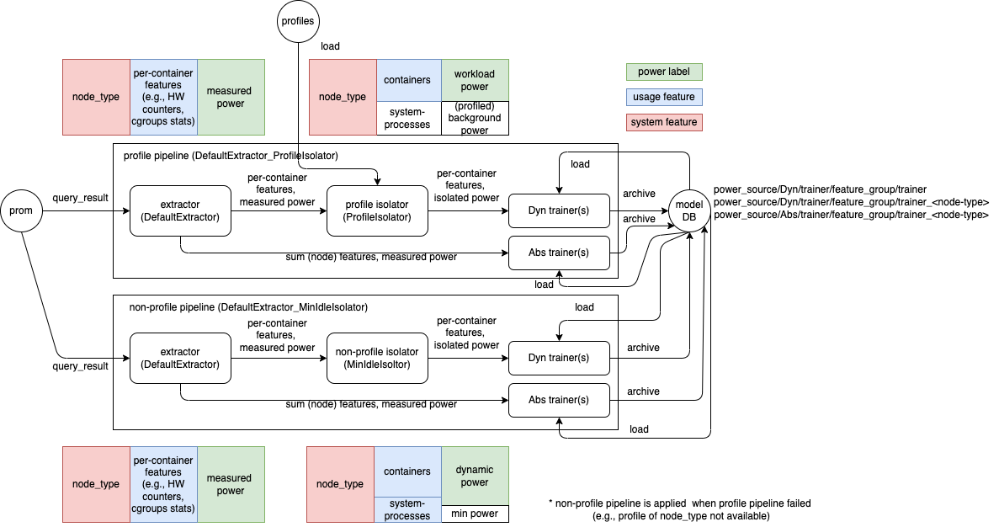

# Training Pipeline
Kepler forms multiple groups of machines (nodes) based on its benchmark performance and trains a model separately for each group. The identified group is exported as `node_type`. 

For each `node_type`, there are two kinds of power model (output), *AbsPower* and *DynPower*, being trained with different groups of features (input). 

## Model Output Type

**AbsPower:** the predicted power is a node power that includes nearly-static power at idling state and dynamic power when running the process on the machine.

**DynPower:** the predicted power is per-process/per-container power that excludes nearly-static power at idling state.

## Model Features
The features are groupped by the metric sources.

**Feature group:**

Group Name|Features|Metric Source(s)
---|---|---
CounterOnly|COUNTER_FEAUTRES|Hardware Counter
CgroupOnly|CGROUP_FEATURES|cGroups
BPFOnly|BPF_FEATURES|BPF
KubeletOnly|KUBELET_FEATURES|Kubelet
IRQOnly|IRQ_FEATURES|BPF
CounterIRQCombined|COUNTER_FEAUTRES, IRQ_FEATURES|BPF and Hardware Counter
WorkloadOnly|COUNTER_FEAUTRES, CGROUP_FEATURES, BPF_FEATURES, IRQ_FEATURES, KUBELET_FEATURES|All except node information
Full|WORKLOAD_FEATURES, SYSTEM_FEATURES|All

## Pipeline

A training pipeline starts from reading the Kepler-exporting metrics from Prometheus query (prom) and finally submits an archived models to the model database (model DB). The pipeline is generally composed of one *extractor*, one *isolator*, and multiple *trainers*. *Extractor* extracts data from the query result for each feature group attached with measured power of each components (e.g., core, dram, package, uncore, platform). *Isolator* further removed the nearly-static power at idling state which is unrelated to the process/container from the extracted results. The output from *isolator* is used by *DynPower* trainers while *AbsPower* trainers directly use the output from *extractor*.

In the current implementation, there are two default active pipelines as shown below. 

They use different isolators: *ProfileIsolator* and *MinIdleIsolator*. *ProfileIsolator* relies on profiled background powers (profiles) and removes resource usages by system processes from the training while *MinIdleIsolator* assumes minimum power as an idle power and includes resource usages by system processes in the training. The pipeline with *ProfileIsolator* will be applied first if the profile that matches the training `node_type` is available. Otherwise, the other pipeline will be applied. (check how profiles are generated [here](./model_profile.md))

*Trainers* implements `Trainer` class. The common process for each `node_type` is to 
1. load previous checkpoint model via implemented `load_local_checkpoint` or `load_remote_checkpoint`. If the checkpoint cannot be loaded, initialize the model by calling implemented `init_model`.
2. load and apply scaler to input data
3. call implemented `train` and save the checkpoint via `save_checkpoint`
4. check whether to achive the model and push to database via `should_archive`. If yes, 
   1. get triner-specific basic metdata via `get_basic_metadata`
   2. fill with required metadata, save it as metadata file (metadata.json)
   3. call `save_model`
   4. If `get_weight_dict` function is implemented (only for linear regression based trainer), the weight dict will be saved in the file named `weight.json`.
   5. archive the model folder. The model name will be in the format `<trainer class>_<node_type>`.
   6. push the archived model and `weight.json` (if available) to the database

The intermediate checkpoint and output of model will be saved locally in folder `MODEL_PATH/<PowerSource>/<ModelOutputType>/<FeatureGroup>`. The default `MODEL_PATH` is `src/models`.
