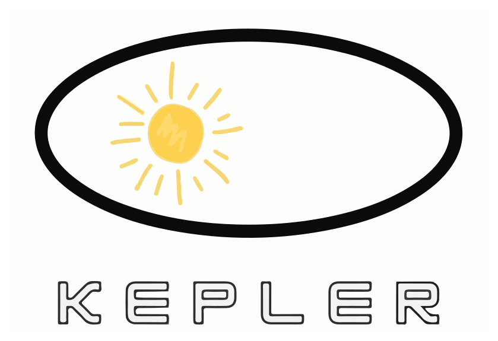

## Kepler Adopters

Organizations below all are using Kepler.

To join this list, please follow [these instructions](https://sustainable-computing.io/project/contributing/).

<!-- markdownlint-disable MD033 -->

[CERN](https://home.cern/)
[Deutsche Telekom](https://www.telekom.com/)
[Grafana Labs](https://grafana.com/)
[Kepler](https://sustainable-computing.io/)
[KubeStellar Console](https://console.kubestellar.io)
[Orange](https://www.orange.com/)

<!-- markdownlint-enable MD033 -->
